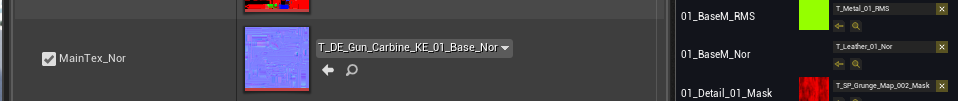
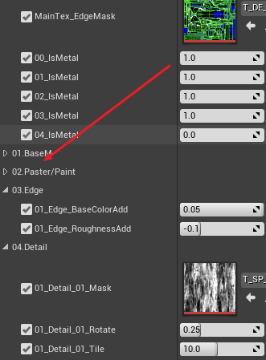
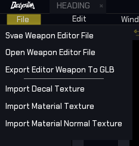
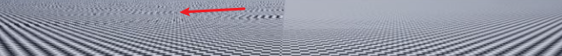

### 为什么会出现这种情况

UImage中读取的是```UTexTure2D```类型的图片，而```void UMaterialInstanceDynamic::SetTextureParameterValue(FName ParameterName, UTexture* Value)```是```UTexture```类型UImage是不支持```UTexture```的

### 实现这种下拉列表的思路



### 按钮触发后对应的逻辑


### 编辑器中的纹理的压缩格式和C++中加载的纹理压缩格式是否一致
一致

### 少通道的图像压缩成多通道，
### 多通道图像压缩成少通道  丢失对应通道的数值信息
### 单独展示一个通道
是以灰度值展示的

### 多级渐远纹理(Mipmap)
当一个400x400的纹理在屏幕中以正常的距离显示为正常大小时，纹理的显示是完全正常的。当屏幕的视角拉远，原来的纹理也会逐渐远离，从而使原来的400x400的纹理的分辨率降低。例如，拉远屏幕与纹理的距离，使得纹理的显示大小降低为200x200，那么原来的纹理就需要收缩到200x200以展示到当前的视角上。这时，可以将原来400x400的纹理通过 ```2x2映射到1x1， 并且使用2x2的像素进行插值计算得到一个像素（无论被映射的多大，都是只取也被映射大小的中心2x2的像素的值拿来做映射）``` 的方式映射到200x200的分辨率。
通过这种方式可以实现视角缩放时的纹理缩放，随着视角越拉越远，纹理将不得不继续缩小分辨率。如果400x400的纹理要收缩的很小，到了10x10，那么根据上述的映射方式，需要将 ```40x40映射到1x1```，此时会有4个像素点参与映射，二其余的396个像素并没有实际使用，这要就产生了纹理的```锯齿```和```摩尔纹```现象。

如果在```40x40映射到1x1```时，使用所有的400个像素点进行平均映射，那么计算量会非常大，大大加重了GPU负担。

#### Mipmap
Mipmap是将纹理映射为原来的一半，再将映射过的分辨率为原来一半的纹理再进行二分映射，逐级向下，知道将原纹理映射为1的像素的纹理。此时，整个映射过程将产生多个映射纹理。在使用过程中，通过不同的屏幕距离的阈值，进行不同分辨率纹理的切换。

Mipmap避免了失真和摩尔纹的现象


######  通过设置ui_normalMatr和通过 笔刷设置UImage的图像过程

######  修改纹理的压缩类型会不会影响对应材质的效果

### 项目打包过程，runtime和editor
 
### 官网文档动画，静态网格、骨骼网格

### 下周任务：实现小人按0~9的按键执行不同的动画 动画类型

### 骨架网格体的内存占用与顶点数量有关，而某些渲染开销与三角形数量的关系更为密切。

### 额外混合

### 创建动画的方法
1. 瞄准偏移
2. 曲线驱动动画
3. 混合空间
4. 在动画序列中，通过关键帧设置指定骨骼的动画

### 动画姿势资源(Animation Pose Assert)
可以通过动画序列创建 动画姿势资源。动画姿势资源中，

### 待：动态动画

###### 瞄准偏移和混合空间

###### 直接限制骨骼的Transform