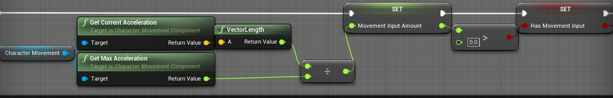

### 检测 player 是否是接收输入状态 (bool bHasMovementInput)
通过角色移动组件(```Character Movement Component```)判断:
通过```Character Movement Component```获取当前的加速度(CA: Vector, ```Get Current Acceleration```)和角色最大加速度(MA: float, 定值， ```Get Max Acceleration```)，求CA的大小值，并计算 CA/MA的值，大于0则 ```bHasMovementInput```为```true```，否则为```false```。


### NewDEPlayer

```DataManagerBase```类保存着```CharacterGuid```，```UCharacterManager```中```TMap<FGuid,ADataManagerBase*> m_CharacterMap```存放所有```DataManagerBase```实例
```UCharacterManager```为单例
