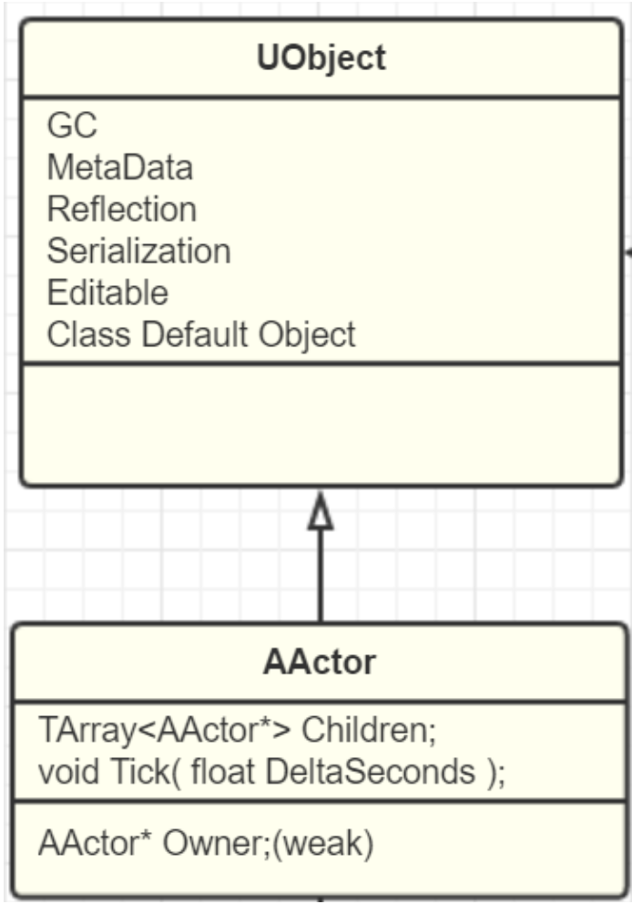

### AActor
所有可以放入关卡的对象都是 Actor，比如摄像机、静态网格体、玩家起始位置。Actor支持三维变换，例如平移、旋转和缩放。你可以通过游戏逻辑代码（C++或蓝图）创建（生成）或销毁Actor。

在C++中，AActor是所有Actor的基类。

注意：Actor不直接保存变换（位置、旋转和缩放）数据；如Actor的根组件存在，则使用它的变换数据。

### GamePlay框架的流程
GameMode::PreLogin


### AActor 
Actor是游戏世界中的元素，也是组件的集合，不是所有Actor都有Transfrom属性，其没有Transform属性，Actor的Transform属性取决于RootComponent，同时只有SceneComponent才有Transform属性，因此这个RootComponent一般为SceneComponent



```C++

/*~
 * Returns location of the RootComponent 
 * this is a template for no other reason than to delay compilation until USceneComponent is defined
 */ 
template<class T>
static FORCEINLINE FVector GetActorLocation(const T* RootComponent)
{
    return (RootComponent != nullptr) ? RootComponent->GetComponentLocation() : FVector(0.f,0.f,0.f);
}
bool AActor::SetActorLocation(const FVector& NewLocation, bool bSweep, FHitResult* OutSweepHitResult, ETeleportType Teleport)
{
    if (RootComponent)
    {
        const FVector Delta = NewLocation - GetActorLocation();
        return RootComponent->MoveComponent(Delta, GetActorQuat(), bSweep, OutSweepHitResult, MOVECOMP_NoFlags, Teleport);
    }
    else if (OutSweepHitResult)
    {
        *OutSweepHitResult = FHitResult();
    }
    return false;
}


```

### ULevel

ALevelScriptActor用来管理关卡中所有的Actor

ULevel中的Actors列表会被排序，将WorldSetting放到第一个，后续为非网络复制Actors，之后是网络复制Actors，并记录网络复制Actors在类表中的首位索引，用于加快网络复制操作。ALevelScriptActor因为是代表关卡蓝图，是允许携带“复制”变量函数的，所以也有可能被排序到后列。


#### ALevelScriptActor 代表的是关卡蓝图
尽管是个AActor子类，但是不管理组件，不拥有Transform，可以看做是管理关卡中所有Actors的容器

关卡是如何实现响应输入的， 即输入组件的创建注册绑定过程

```C++
void ALevelScriptActor::PreInitializeComponents()
{
    if (UInputDelegateBinding::SupportsInputDelegate(GetClass()))
    {
        // create an InputComponent object so that the level script actor can bind key events
        InputComponent = NewObject<UInputComponent>(this);
        InputComponent->RegisterComponent();
        UInputDelegateBinding::BindInputDelegates(GetClass(), InputComponent);
    }
    Super::PreInitializeComponents();
}
```


### 什么时候创建的GameMode
UE也只会为第一次创建World时加载PersistentLevel的时候创建GameMode，在后续的LoadStreamingLevel时候，并不会再动态创建出别的GameMode，所以GameMode从始至终只有一个，PersistentLevel的那个。