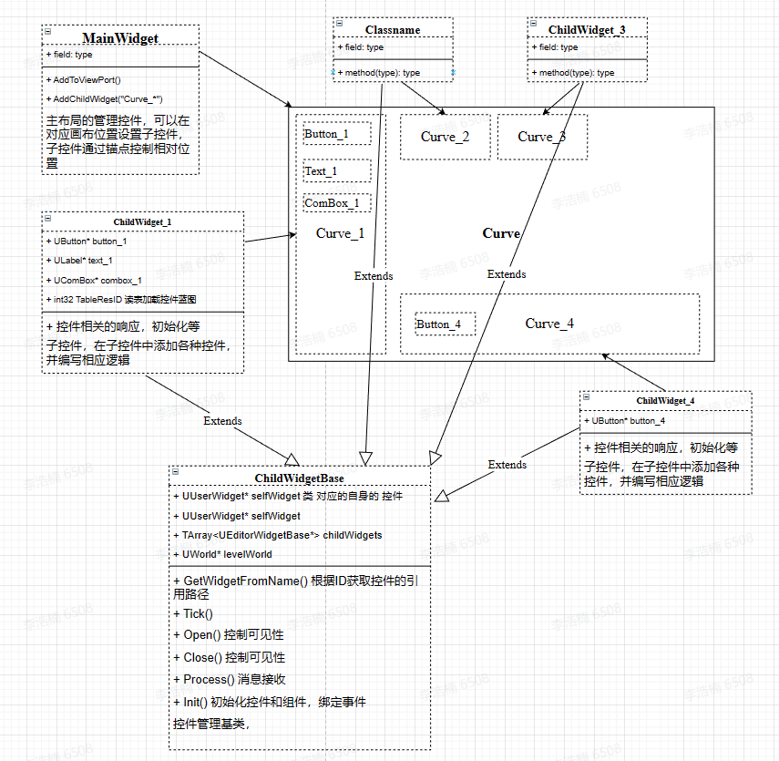
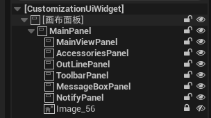
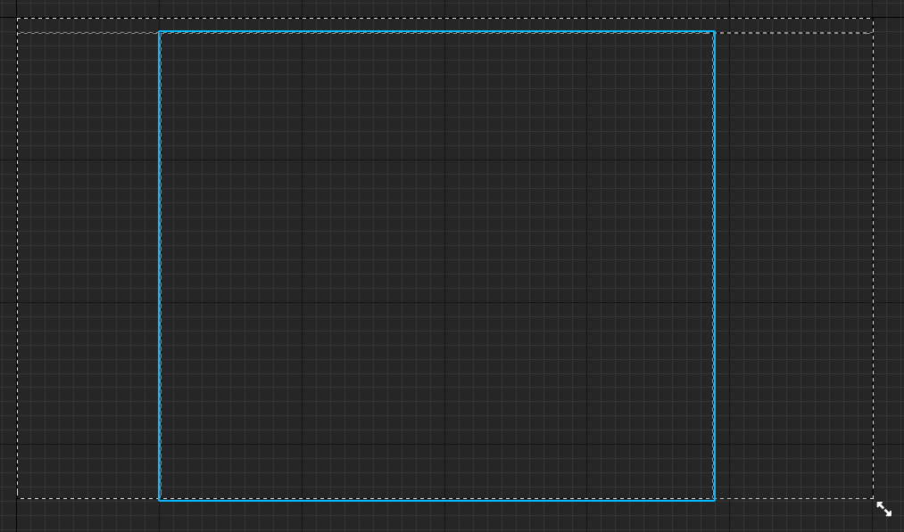
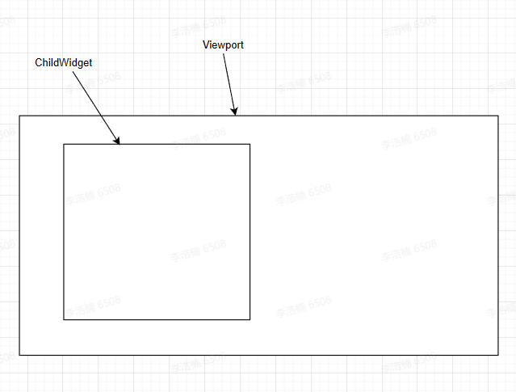
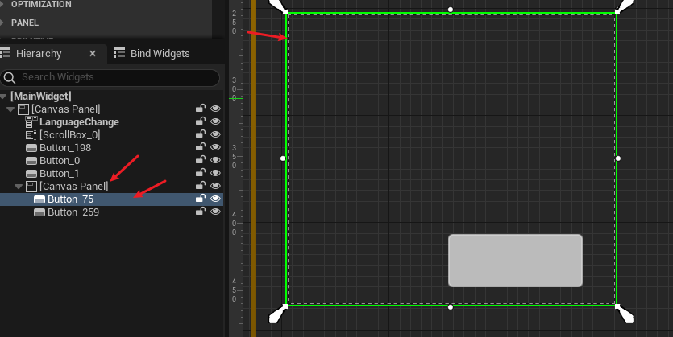
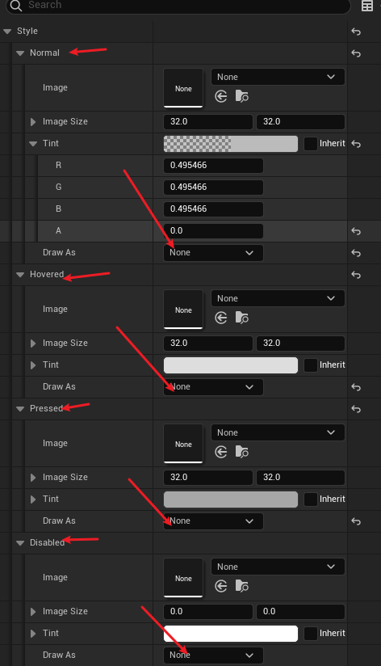
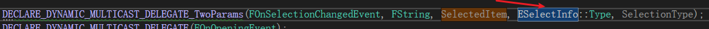
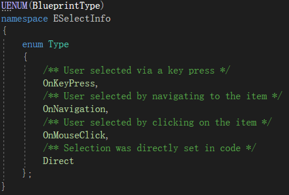

###UI控件的设计模式

### 主控件
> 用于管理布局
#### 主控件蓝图设计



### 子控件
>
1. 获取主视图中的 画布组件，在画布 添加子控件

### 控件的可见性
>通过设置控件的可见性实现 视觉效果

### 控件大小 有父控件的大小决定

### Slot源码

### Vertical Box 元素无法置顶的替代方案
使用另一个Vertical Box放在当前的Vertical Box顶部，并将对应的元素转移到新的Vertical Box

### 脚本获取控件的`Slot`信息
`Slot`信息只是设置了 控件的布局 规则， 并不是表示 实时的视口控件大小
```C++
UWidget* panel = mainUI->GetWidget()->GetWidgetFromName(FName("MainViewPanel"));
		if (panel)
		{ 
			UCanvasPanelSlot* cps = Cast<UCanvasPanelSlot>(panel->Slot);
			if (cps)
			{
                // Slot四个方向对应的位置信息
				cps->GetPosition();
				cps->GetSize();
			}
		}
```

#### 检测鼠标是否在 当前视口中子控件的区域内的方法 

1. 通过在 控件层级的 最顶层添加 一个按钮，覆盖整个父控件的 大小，并将 按钮的 对应 事件的显示设置为空，并设置 `OnHovered` 和`OnUnhovered`事件响应，实现鼠标判断是否在 该区域内
    
    

### 控件的可视性

### 控件事件触发 条件
1. Slider 滑动条: OnValueChanged ，可以通过 滑动条触发，无法通过SetValue方法触发
2. ComboBox 下拉菜单： FOnSelectionChangedEvent， 设置触发事件的条件
   

### UserWidget 和 基础控件
> UserWidget添加到父基础控件时，会重置 UserWidget中的基础控件的值为 面板默认值，需在添加前重新设置预期值

