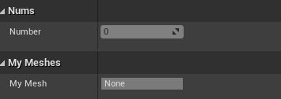

https://docs.unrealengine.com/4.27/zh-CN/ProgrammingAndScripting/GameplayArchitecture/Properties/

### 0
```C++
UPROPERTY(VisibleAnywhere, Category="Nums")
int32 number;

UPROPERTY(VisibleAnywhere,Category = "MyMeshes")
UStaticMeshComponent* myMesh;
```
Editor


#
### 绑定输入按键
1. 通过蓝图直接创建对应的事件处理节点
2. 通过```APawn```类或其子类，在 ```SetupPlayerInputComonent()```中，将对应的按键与按键触发的自定义处理函数绑定(绑定的系统按键可以在项目设置的input中设置)。
   ```C++
   void AKeyBoardCharacter::SetupPlayerInputComponent(UInputComponent* PlayerInputComponent)
    {
        Super::SetupPlayerInputComponent(PlayerInputComponent);
        PlayerInputComponent->BindAction("KeyUp", IE_Pressed, this, &AKeyBoardCharacter::KeyUp);
        PlayerInputComponent->BindAction("KeyDown", IE_Pressed,this, &AKeyBoardCharacter::KeyDown); 
    }

    void AKeyBoardCharacter::KeyDown()
    {
        number = number > 0 ? (number - 1) : number;
        UE_LOG(LogTemp, Warning, TEXT("Down"));
    }

    void AKeyBoardCharacter::KeyUp()
    {
        number = number < 9 ? (number + 1) : number;
    }
    ```
3. 对于一般的AActor类，也实现了对输入的响应，在AActor的类中设置```InputComponent()```绑定按键与要触发的自定义函数（一般的AActor并不是默认响应输入的，需要绑定当前的Controller）
    ```C++
    void AClickTestActor::BeginPlay()
    {
        Super::BeginPlay();
        //获取PlayerController
        APlayerController* PlayerController = UGameplayStatics::GetPlayerController(GWorld, 0);
        if (PlayerController!=nullptr)
        {
            //传入Playercontroller开启Input
            EnableInput(PlayerController);
            //绑定按键方法
            InputComponent->BindAction("W", IE_Pressed, this, &AClickTestActor::ClickFunc);
        }
    }

    void AClickTestActor::ClickFunc()
    {
        UE_LOG(LogTemp, Warning, TEXT("Click W"));
    }

    ```

### 什么是UMG。
虚幻示意图形界面设计器（Unreal Motion Graphics UI Designer）(UMG) 是一个可视化的UI创作工具，可以用来创建UI元素，如游戏中的HUD、菜单或您希望呈现给用户的其他界面相关图形。UMG的核心是控件，这些控件是一系列预先制作的函数，可用于构建界面（如按钮、复选框、滑块、进度条等）。这些控件在专门的控件蓝图中编辑，该蓝图使用两个选项卡进行构造：设计器（Designer）选项卡允许界面和基本函数的可视化布局，而图表（Graph）选项卡提供所使用控件背后的功能。