### 如何创建GameMode

### 在c++中的中文字符串 UE编辑器中显示乱码
```
使用TEXT()宏创建字符串
```
#

### (```C++```)在自定义```GameMode```:```UMGPracticeGameMode```中将UI控件输出到视口(```viewport```)
将```World```的默认```GameMode```设置为```UMGPracticeGameMode```
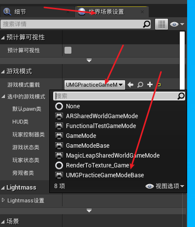

分别在```UMGPracticeGameMode```的```.h```和```.cpp```文件中添加以下代码：
```C++
// .h
public:
    /** 移除当前菜单控件，并在指定类（如有）中新建控件。*/
    UFUNCTION(BlueprintCallable, Category = "UMG Game")
    void ChangeMenuWidget(TSubclassOf<UUserWidget> NewWidgetClass);

protected:
    /** 游戏开始时调用。*/
    virtual void BeginPlay() override;

    /** 游戏开始时，用作菜单的控件类。*/
    UPROPERTY(EditAnywhere, BlueprintReadOnly, Category = "UMG Game")
    TSubclassOf<UUserWidget> StartingWidgetClass;

    /** 用作菜单的控件实例。*/
    UPROPERTY()
    UUserWidget* CurrentWidget;
```

```C++
// .cpp

#include "HowTo_UMG.h"
#include "HowTo_UMGGameMode.h"

void AHowTo_UMGGameMode::BeginPlay()
{
    Super::BeginPlay();
    ChangeMenuWidget(StartingWidgetClass);
}

void AHowTo_UMGGameMode::ChangeMenuWidget(TSubclassOf<UUserWidget> NewWidgetClass)
{
    if (CurrentWidget != nullptr)
    {
        CurrentWidget->RemoveFromViewport();
        CurrentWidget = nullptr;
    }
    if (NewWidgetClass != nullptr)
    {
        CurrentWidget = CreateWidget<UUserWidget>(GetWorld(), NewWidgetClass);
        if (CurrentWidget != nullptr)
        {
            CurrentWidget->AddToViewport();
        }
    }
}
```

### 绑定输入按键
#### 注：同一场景的AActor可以设置同一个Controller，多个AActor可以同时响应同一个按键（在BindAction().bConsumeInput=false将输入消耗设为否）
1. 通过蓝图直接创建对应的事件处理节点
2. 通过```APawn```类或其子类，在 ```SetupPlayerInputComonent()```中，将对应的按键与按键触发的自定义处理函数绑定(绑定的系统按键可以在项目设置的input中设置)。
   ```C++
   void AKeyBoardCharacter::SetupPlayerInputComponent(UInputComponent* PlayerInputComponent)
    {
        Super::SetupPlayerInputComponent(PlayerInputComponent);
        PlayerInputComponent->BindAction("KeyUp", IE_Pressed, this, &AKeyBoardCharacter::KeyUp);
        PlayerInputComponent->BindAction("KeyDown", IE_Pressed,this, &AKeyBoardCharacter::KeyDown); 
    }

    void AKeyBoardCharacter::KeyDown()
    {
        number = number > 0 ? (number - 1) : number;
        UE_LOG(LogTemp, Warning, TEXT("Down"));
    }

    void AKeyBoardCharacter::KeyUp()
    {
        number = number < 9 ? (number + 1) : number;
    }
    ```
3. 对于一般的AActor类，也实现了对输入的响应，在AActor的类中设置```InputComponent()```绑定按键与要触发的自定义函数（一般的AActor并不是默认响应输入的，需要绑定当前的Controller）（同样需要在项目设置中的input中添加操作映射）
    ```C++
    void AClickTestActor::BeginPlay()
    {
        Super::BeginPlay();
        //获取PlayerController
        APlayerController* PlayerController = UGameplayStatics::GetPlayerController(GWorld, 0);
        if (PlayerController!=nullptr)
        {
            //传入Playercontroller开启Input
            EnableInput(PlayerController);
            //绑定按键方法
            InputComponent->BindAction("W", IE_Pressed, this, &AClickTestActor::ClickFunc);
        }
    }

    void AClickTestActor::ClickFunc()
    {
        UE_LOG(LogTemp, Warning, TEXT("Click W"));
    }

    ```

### 什么是UMG。
虚幻示意图形界面设计器（Unreal Motion Graphics UI Designer）(UMG) 是一个可视化的UI创作工具，可以用来创建UI元素，如游戏中的HUD、菜单或您希望呈现给用户的其他界面相关图形。UMG的核心是控件，这些控件是一系列预先制作的函数，可用于构建界面（如按钮、复选框、滑块、进度条等）。这些控件在专门的控件蓝图中编辑，该蓝图使用两个选项卡进行构造：设计器（Designer）选项卡允许界面和基本函数的可视化布局，而图表（Graph）选项卡提供所使用控件背后的功能。


### 关于更换Visual studio版本问题
更换```Visual studio```版本后，直接使用ue或项目部文件启动会出现不兼容的情况，需要在UE编辑器中的编辑栏->编辑器偏好设置->通用->源代码 中将启动项改为对应版本

### 插件加载
在新建项目中，在项目文件夹（如项目```UMGProject```）下，创建```Plugins```文件夹，将对应插件文件夹复制到```Plugins```中，打开UE，在文件->刷新VS项目后，打开VS项目，关闭UE，VS中重新编译项目后，执行不调试。

### 插件添加子模块
在[ProjectName]->Plugins->[PluginName]->Source中
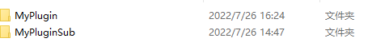
创建```MyPluginSub```新模块对应的文件夹，并初始化内容
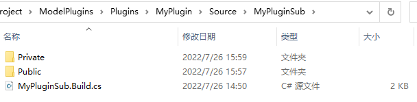
初始化内容```MyPluginSub.Build.cs```文件、```Private```中的```MyPluginSub.cpp```和```Public```中的```MyPluginSub.h```文件。
（可以复制MyPlugin模块的对应文件，并替换内容实现初始化。或者新建项目中创建一个插件，复制对应的文件即可）
初始化结束后，重新生成项目
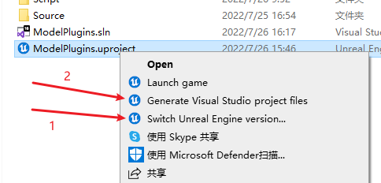
引擎版本在首次生成时使用，删除对应的```Intermediate```文件夹和.sln文件，再生成VS项目文件。


### 设置容器的可视性(按钮控制下拉列表是否可见)
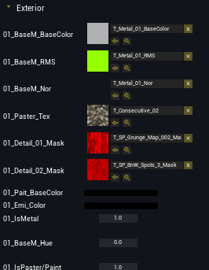
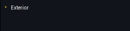
控制对应的容器面板```MaterialList```的隐藏与显示
```C++
void UAttributesui::ShowMaterialPanel()
{
	
	if (MaterialList)
	{
		if (MaterialList->GetVisibility() == ESlateVisibility::Hidden)
		{
			ShowTriangleBtn(EParameListTye::E_MATERIAL, EParameListState::E_SHOW);
			MaterialList->SetVisibility(ESlateVisibility::SelfHitTestInvisible);
		}
		else
		{
			ShowTriangleBtn(EParameListTye::E_MATERIAL, EParameListState::E_HIDE);
			MaterialList->SetVisibility(ESlateVisibility::Hidden);
		}
	}
}
```

### ```C++```中创建控件蓝图实例和获取控件蓝图中的现有控件
#### 创建控件蓝图，编辑器中获取蓝图的引用
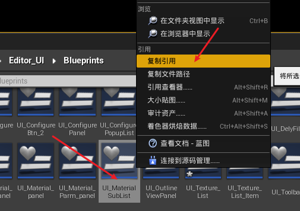
```C++
uiPath = TEXT("Blueprint \'/DelysiumWeaponEditor/Editor_UI/Blueprints/UI_Material_panel.UI_Material_panel_C\'");
MaterialTextureUiClass = LoadClass<UUserWidget>(nullptr, *uiPath);
NewWidget = CreateWidget<UUserWidget>(GetWorld(), MaterialTextureUiClass);
```
#### 获取蓝图实例中的控件
```C++
// "Attributes"为在蓝图控件中对应的控件变量名
UCanvasPanel* canvasPanel = dynamic_cast<UCanvasPanel*>(AttrbutesWidget->GetWidgetFromName(TEXT("Attributes")));
```

### ```C++```中为按钮控件动态绑定事
```C++
//获取按钮控件
DecalEditBtn = dynamic_cast<UButton*>(AttrbutesWidget->GetWidgetFromName(TEXT("IsEditBtn")));

if (DecalEditBtn)
{
    DecalEditBtn->OnPressed.AddDynamic(this, &UAttributesui::DwonDecalEdit);
}
```

### C++中将子控件添加到父控件上（一般父控件是一个容器）
对于不同类型的父容器控件，对应不同的方法
```C++
// 如画布作为父容器控件
panel->AddChildToCanvas(childWidget);
// 如垂直框作为父容器控件
verticalBox->AddChildToVerticalBox(childWidget);
```

### 动画姿势资产(Animation Pose Assert)
可以通过动画序列创建 动画姿势资产。动画姿势资产中，可以使用每一帧的动画，通过曲线驱动的方式创建出新的动画序列。
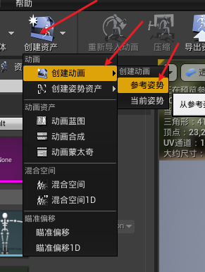
创建的动画序列需要设置预览姿势资产
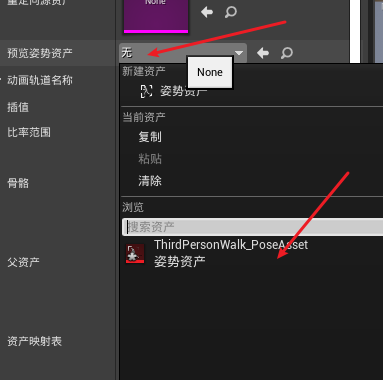
通过对应的序号创建曲线
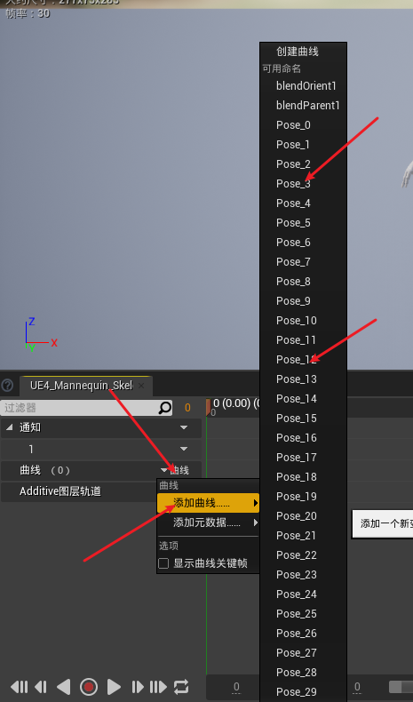


### 叠加动画(Additive Animation)
将要叠加的动画(PoseA)需要设置 叠加的基础姿势(BasePose)，在动画蓝图中与另一个动画叠加(PoseB)
```
D(a) = PoseA - PoseBase
PoseC = PoseB + D(a)
```
##### 叠加动画的动画蓝图节点
叠加动画使用：一般，2段不同的动画分别控制了不同的骨骼时，使用叠加，如2段动画，除了眨眼和张嘴存在差异，其余的骨骼都大致相同时，想要将眨眼和张嘴同时全部获取叠加在一起。
```应用Additive动画```节点对应 ```PoseC = PoseB + D(a)```↓
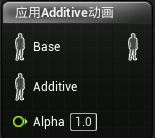
蓝图节点细节面板↓
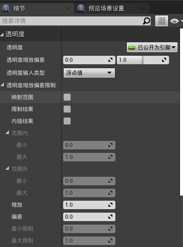
设置```Alpha```节点控制 相当于叠加度，可以通过 设置```透明度输入类型```为```布尔值```或```动画曲线值```设置动画过渡↓
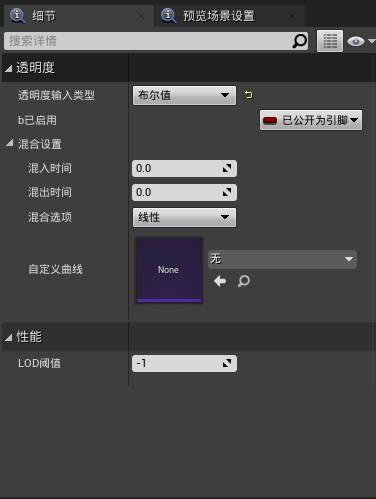
```混入时间``` 表示 ```应用Additive动画```节点中的 输入```Base```过渡到叠加后的节点的过度时间； ```混出时间``` 表示 从叠加后的状态到 ```应用Additive动画```节点中 输入

```Base```的过度时间。↑
#
```创建动态Additive```节点对应 ```D(a) = PoseA - PoseBase```
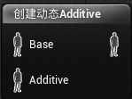


##### 创建动画序列的Additive
在动画序列的资产面板中设置 ```附加设置```
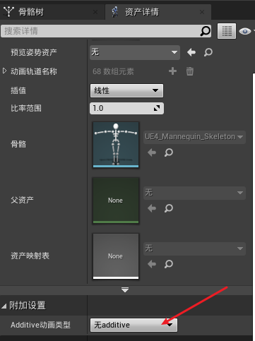
设置为以下形式，此时，该动画在动画蓝图中可作为Additive的输入。
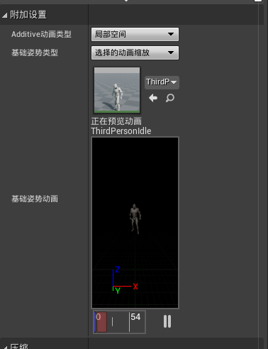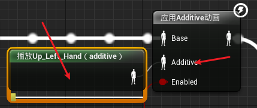

局部空间(Local Space)的含义: 关节的本地空间，如```hand_l```的关节的局部空间为以其父关节为原点的空间。
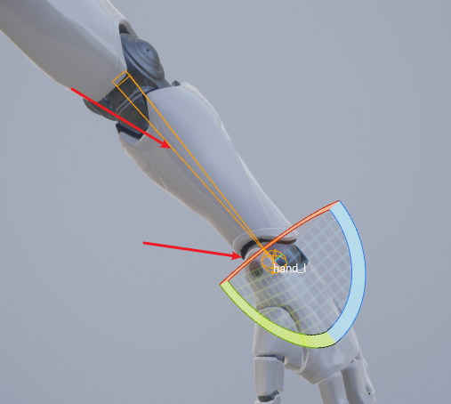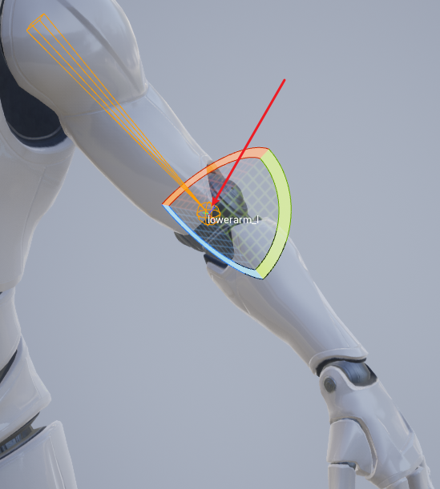

### 骨架（Skeleton）
骨架由骨骼（关节）组成
```C++
//// 骨架和骨骼的结构体源码部分信息
```C++
struct FReferenceSkeleton
{
	FReferenceSkeleton(bool bInOnlyOneRootAllowed = true)
		:bOnlyOneRootAllowed(bInOnlyOneRootAllowed)
	{}

private:
	//RAW BONES: Bones that exist in the original asset
	/** Reference bone related info to be serialized **/
    ///  资产中骨架的骨骼信息
    // 骨架中 骨骼节点列表成员
	TArray<FMeshBoneInfo>	RawRefBoneInfo;
	/** Reference bone transform **/
    // 骨架中 对应索引的骨骼 Transform信息
	TArray<FTransform>		RawRefBonePose;


    /// 包含用户添加的虚拟骨骼的全部骨骼信息
	//FINAL BONES: Bones for this skeleton including user added virtual bones
	/** Reference bone related info to be serialized **/
	TArray<FMeshBoneInfo>	FinalRefBoneInfo;
	/** Reference bone transform **/
	TArray<FTransform>		FinalRefBonePose;

	/** TMap to look up bone index from bone name. */
	TMap<FName, int32>		RawNameToIndexMap;
	TMap<FName, int32>		FinalNameToIndexMap;

	// cached data to allow virtual bones to be built into poses
	TArray<FBoneIndexType>  RequiredVirtualBones;
	TArray<FVirtualBoneRefData> UsedVirtualBoneData;

	/** Whether this skeleton is limited to one root or not 
	 *	Multi root is not supported in general Skeleton/SkeletalMesh
	 *	But there are other components that can use this and support multi root - i.e. ControlRig
	 *	This sturct is used in draw code, the long term plan may be detach this from draw code
	 *	and use interface struct
	 */
	bool bOnlyOneRootAllowed;

    //....
}


struct FMeshBoneInfo
{
	// Bone's name.
	FName Name;

	// 0/NULL if this is the root bone. 
	int32 ParentIndex;
    // ....
};

```

骨架类源码(USkeleton)
```C++
/// 骨架类源码
```

通过骨架中的骨骼和transform信息可以看出骨架主要聚焦于动画的功能。
骨架资源可以共享给不同的骨架网格体，使得骨架网格体可以共享动画和动画蓝图

骨架其他功能：
1. 动画重定位
2. 创建和保存插槽
3. 保存动画通知
4. 保存动画曲线和保存槽名称

### 类Class 骨骼（骨架）（USkeleton）、骨骼网格(USkeletalMesh)、骨骼网格体组件(USkeletalMeshComponent)
```Skeleton```中存储的是```Bones```的信息，```Skeleton```是连接动画和骨骼网格的桥梁，动画的关键帧控制骨骼变换，骨骼通过顶点混合控制网格顶点的位置。

#
### 角色的移动是基于胶囊体实现的，因此对于没有胶囊体组件的Actor是无法正常使用UCharacterMovementComponent的。


### 角色（Pawn）和角色控制器(Controller)Transform

### 曲线

### 虚拟骨骼

### 直接使用的过渡方法
通过获取每一帧的时间间隔(delta， 事件Tick的 DeltaTime输出)，每次tick时进行delta的累加，把累加值作为blends的权重，实现过渡。

1. 创建函数```Update_Hand_With_Time```条件满足时，对变量```Up_Hand_Time```进行累加，不满足条件时，```Up_Hand_Time```递减，并限制```Up_Hand_Time```的范围```0~1```以满足混合权重的取值范围。
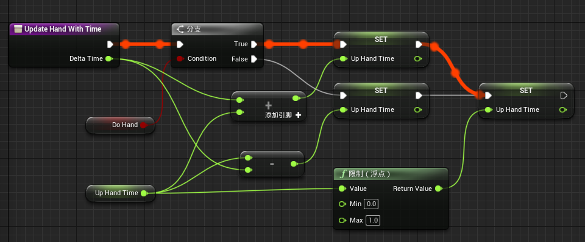

2. 在事件图表中调用函数```Update_Hand_With_Time```，实现tick时更新```Up_Hand_Time```d的值
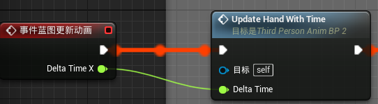

3. 将变量```Up_Hand_Time```设置为混合节点的权重输入
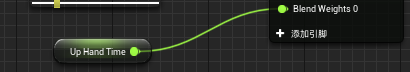

