### 如何创建GameMode

### 在c++中的中文字符串 UE编辑器中显示乱码
```
使用TEXT()宏创建字符串
```
#

### (```C++```)在自定义```GameMode```:```UMGPracticeGameMode```中将UI控件输出到视口(```viewport```)
将```World```的默认```GameMode```设置为```UMGPracticeGameMode```


分别在```UMGPracticeGameMode```的```.h```和```.cpp```文件中添加以下代码：
```C++
// .h
public:
    /** 移除当前菜单控件，并在指定类（如有）中新建控件。*/
    UFUNCTION(BlueprintCallable, Category = "UMG Game")
    void ChangeMenuWidget(TSubclassOf<UUserWidget> NewWidgetClass);

protected:
    /** 游戏开始时调用。*/
    virtual void BeginPlay() override;

    /** 游戏开始时，用作菜单的控件类。*/
    UPROPERTY(EditAnywhere, BlueprintReadOnly, Category = "UMG Game")
    TSubclassOf<UUserWidget> StartingWidgetClass;

    /** 用作菜单的控件实例。*/
    UPROPERTY()
    UUserWidget* CurrentWidget;
```

```C++
// .cpp

#include "HowTo_UMG.h"
#include "HowTo_UMGGameMode.h"

void AHowTo_UMGGameMode::BeginPlay()
{
    Super::BeginPlay();
    ChangeMenuWidget(StartingWidgetClass);
}

void AHowTo_UMGGameMode::ChangeMenuWidget(TSubclassOf<UUserWidget> NewWidgetClass)
{
    if (CurrentWidget != nullptr)
    {
        CurrentWidget->RemoveFromViewport();
        CurrentWidget = nullptr;
    }
    if (NewWidgetClass != nullptr)
    {
        CurrentWidget = CreateWidget<UUserWidget>(GetWorld(), NewWidgetClass);
        if (CurrentWidget != nullptr)
        {
            CurrentWidget->AddToViewport();
        }
    }
}
```

### 绑定输入按键
#### 注：同一场景的AActor可以设置同一个Controller，多个AActor可以同时响应同一个按键（在BindAction().bConsumeInput=false将输入消耗设为否）
1. 通过蓝图直接创建对应的事件处理节点
   在项目设置->输入 中创建操作映射或者轴映射，
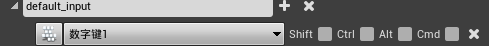
    在可以处理输入的蓝图中获取对应名称的蓝图事件节点
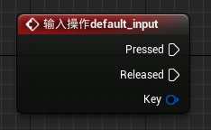
1. 通过```APawn```类或其子类，在 ```SetupPlayerInputComonent()```中，将对应的按键与按键触发的自定义处理函数绑定(绑定的系统按键可以在项目设置的input中设置)。
   ```C++
   void AKeyBoardCharacter::SetupPlayerInputComponent(UInputComponent* PlayerInputComponent)
    {
        Super::SetupPlayerInputComponent(PlayerInputComponent);
        PlayerInputComponent->BindAction("KeyUp", IE_Pressed, this, &AKeyBoardCharacter::KeyUp);
        PlayerInputComponent->BindAction("KeyDown", IE_Pressed,this, &AKeyBoardCharacter::KeyDown); 
    }

    void AKeyBoardCharacter::KeyDown()
    {
        number = number > 0 ? (number - 1) : number;
        UE_LOG(LogTemp, Warning, TEXT("Down"));
    }

    void AKeyBoardCharacter::KeyUp()
    {
        number = number < 9 ? (number + 1) : number;
    }
    ```
2. 对于一般的AActor类，也实现了对输入的响应，在AActor的类中设置```InputComponent()```绑定按键与要触发的自定义函数（一般的AActor并不是默认响应输入的，需要绑定当前的Controller）（同样需要在项目设置中的input中添加操作映射）
    ```C++
    void AClickTestActor::BeginPlay()
    {
        Super::BeginPlay();
        //获取PlayerController
        APlayerController* PlayerController = UGameplayStatics::GetPlayerController(GWorld, 0);
        if (PlayerController!=nullptr)
        {
            //传入Playercontroller开启Input
            EnableInput(PlayerController);
            //绑定按键方法
            InputComponent->BindAction("W", IE_Pressed, this, &AClickTestActor::ClickFunc);
        }
    }

    void AClickTestActor::ClickFunc()
    {
        UE_LOG(LogTemp, Warning, TEXT("Click W"));
    }

    ```

### 什么是UMG。
虚幻示意图形界面设计器（Unreal Motion Graphics UI Designer）(UMG) 是一个可视化的UI创作工具，可以用来创建UI元素，如游戏中的HUD、菜单或您希望呈现给用户的其他界面相关图形。UMG的核心是控件，这些控件是一系列预先制作的函数，可用于构建界面（如按钮、复选框、滑块、进度条等）。这些控件在专门的控件蓝图中编辑，该蓝图使用两个选项卡进行构造：设计器（Designer）选项卡允许界面和基本函数的可视化布局，而图表（Graph）选项卡提供所使用控件背后的功能。


### 关于更换Visual studio版本问题
更换```Visual studio```版本后，直接使用ue或项目部文件启动会出现不兼容的情况，需要在UE编辑器中的编辑栏->编辑器偏好设置->通用->源代码 中将启动项改为对应版本

### 插件加载
在新建项目中，在项目文件夹（如项目```UMGProject```）下，创建```Plugins```文件夹，将对应插件文件夹复制到```Plugins```中，打开UE，在文件->刷新VS项目后，打开VS项目，关闭UE，VS中重新编译项目后，执行不调试。

### 插件添加子模块
在[ProjectName]->Plugins->[PluginName]->Source中

创建```MyPluginSub```新模块对应的文件夹，并初始化内容

初始化内容```MyPluginSub.Build.cs```文件、```Private```中的```MyPluginSub.cpp```和```Public```中的```MyPluginSub.h```文件。
（可以复制MyPlugin模块的对应文件，并替换内容实现初始化。或者新建项目中创建一个插件，复制对应的文件即可）
初始化结束后，重新生成项目

引擎版本在首次生成时使用，删除对应的```Intermediate```文件夹和.sln文件，再生成VS项目文件。


### 设置容器的可视性(按钮控制下拉列表是否可见)


控制对应的容器面板```MaterialList```的隐藏与显示
```C++
void UAttributesui::ShowMaterialPanel()
{
	
	if (MaterialList)
	{
		if (MaterialList->GetVisibility() == ESlateVisibility::Hidden)
		{
			ShowTriangleBtn(EParameListTye::E_MATERIAL, EParameListState::E_SHOW);
			MaterialList->SetVisibility(ESlateVisibility::SelfHitTestInvisible);
		}
		else
		{
			ShowTriangleBtn(EParameListTye::E_MATERIAL, EParameListState::E_HIDE);
			MaterialList->SetVisibility(ESlateVisibility::Hidden);
		}
	}
}
```

### ```C++```中创建控件蓝图实例和获取控件蓝图中的现有控件
#### 创建控件蓝图，编辑器中获取蓝图的引用

```C++
uiPath = TEXT("Blueprint \'/DelysiumWeaponEditor/Editor_UI/Blueprints/UI_Material_panel.UI_Material_panel_C\'");
MaterialTextureUiClass = LoadClass<UUserWidget>(nullptr, *uiPath);
NewWidget = CreateWidget<UUserWidget>(GetWorld(), MaterialTextureUiClass);
```
#### 获取蓝图实例中的控件
```C++
// "Attributes"为在蓝图控件中对应的控件变量名
UCanvasPanel* canvasPanel = dynamic_cast<UCanvasPanel*>(AttrbutesWidget->GetWidgetFromName(TEXT("Attributes")));
```

### ```C++```中为按钮控件动态绑定事
```C++
//获取按钮控件
DecalEditBtn = dynamic_cast<UButton*>(AttrbutesWidget->GetWidgetFromName(TEXT("IsEditBtn")));

if (DecalEditBtn)
{
    DecalEditBtn->OnPressed.AddDynamic(this, &UAttributesui::DwonDecalEdit);
}
```

### C++中将子控件添加到父控件上（一般父控件是一个容器）
对于不同类型的父容器控件，对应不同的方法
```C++
// 如画布作为父容器控件
panel->AddChildToCanvas(childWidget);
// 如垂直框作为父容器控件
verticalBox->AddChildToVerticalBox(childWidget);
```

### 动画姿势资产(Animation Pose Assert)
可以通过动画序列创建 动画姿势资产。动画姿势资产中，可以使用每一帧的动画，通过曲线驱动的方式创建出新的动画序列。

创建的动画序列需要设置预览姿势资产

通过对应的序号创建曲线


### 叠加动画(Additive Animation)
将要叠加的动画(PoseA)需要设置 叠加的基础姿势(BasePose)，在动画蓝图中与另一个动画叠加(PoseB)
```
D(a) = PoseA - PoseBase
PoseC = PoseB + D(a)
```
##### 叠加动画的动画蓝图节点
叠加动画使用：一般，2段不同的动画分别控制了不同的骨骼时，使用叠加，如2段动画，除了眨眼和张嘴存在差异，其余的骨骼都大致相同时，想要将眨眼和张嘴同时全部获取叠加在一起。
```应用Additive动画```节点对应 ```PoseC = PoseB + D(a)```↓

蓝图节点细节面板↓

设置```Alpha```节点控制 相当于叠加度，可以通过 设置```透明度输入类型```为```布尔值```或```动画曲线值```设置动画过渡↓

```混入时间``` 表示 ```应用Additive动画```节点中的 输入```Base```过渡到叠加后的节点的过度时间； ```混出时间``` 表示 从叠加后的状态到 ```应用Additive动画```节点中 输入

```Base```的过度时间。↑
#
```创建动态Additive```节点对应 ```D(a) = PoseA - PoseBase```


##### 创建动画序列的Additive
在动画序列的资产面板中设置 ```附加设置```

设置为以下形式，此时，该动画在动画蓝图中可作为Additive的输入。


局部空间(Local Space)的含义: 关节的本地空间，如```hand_l```的关节的局部空间为以其父关节为原点的空间。


### 骨架（Skeleton）
骨架由骨骼（关节）组成
```C++
//// 骨架和骨骼的结构体源码部分信息
```C++
struct FReferenceSkeleton
{
	FReferenceSkeleton(bool bInOnlyOneRootAllowed = true)
		:bOnlyOneRootAllowed(bInOnlyOneRootAllowed)
	{}

private:
	//RAW BONES: Bones that exist in the original asset
	/** Reference bone related info to be serialized **/
    ///  资产中骨架的骨骼信息
    // 骨架中 骨骼节点列表成员
	TArray<FMeshBoneInfo>	RawRefBoneInfo;
	/** Reference bone transform **/
    // 骨架中 对应索引的骨骼 Transform信息
	TArray<FTransform>		RawRefBonePose;


    /// 包含用户添加的虚拟骨骼的全部骨骼信息
	//FINAL BONES: Bones for this skeleton including user added virtual bones
	/** Reference bone related info to be serialized **/
	TArray<FMeshBoneInfo>	FinalRefBoneInfo;
	/** Reference bone transform **/
	TArray<FTransform>		FinalRefBonePose;

	/** TMap to look up bone index from bone name. */
	TMap<FName, int32>		RawNameToIndexMap;
	TMap<FName, int32>		FinalNameToIndexMap;

	// cached data to allow virtual bones to be built into poses
	TArray<FBoneIndexType>  RequiredVirtualBones;
	TArray<FVirtualBoneRefData> UsedVirtualBoneData;

	/** Whether this skeleton is limited to one root or not 
	 *	Multi root is not supported in general Skeleton/SkeletalMesh
	 *	But there are other components that can use this and support multi root - i.e. ControlRig
	 *	This sturct is used in draw code, the long term plan may be detach this from draw code
	 *	and use interface struct
	 */
	bool bOnlyOneRootAllowed;

    //....
}


struct FMeshBoneInfo
{
	// Bone's name.
	FName Name;

	// 0/NULL if this is the root bone. 
	int32 ParentIndex;
    // ....
};

```

骨架类源码(USkeleton)
```C++
/// 骨架类源码
```

通过骨架中的骨骼和transform信息可以看出骨架主要聚焦于动画的功能。
骨架资源可以共享给不同的骨架网格体，使得骨架网格体可以共享动画和动画蓝图

骨架其他功能：
1. 动画重定位
2. 创建和保存插槽
3. 保存动画通知
4. 保存动画曲线和保存槽名称

### 类Class 骨骼（骨架）（USkeleton）、骨骼网格(USkeletalMesh)、骨骼网格体组件(USkeletalMeshComponent)
```Skeleton```中存储的是```Bones```的信息，```Skeleton```是连接动画和骨骼网格的桥梁，动画的关键帧控制骨骼变换，骨骼通过顶点混合控制网格顶点的位置。

#
### 角色的移动是基于胶囊体实现的，因此对于没有胶囊体组件的Actor是无法正常使用UCharacterMovementComponent的。


### 角色（Pawn）和角色控制器(Controller)Transform

### 曲线

### 虚拟骨骼

### 直接使用的过渡方法
通过获取每一帧的时间间隔(delta， 事件Tick的 DeltaTime输出)，每次tick时进行delta的累加，把累加值作为blends的权重，实现过渡。

1. 创建函数```Update_Hand_With_Time```条件满足时，对变量```Up_Hand_Time```进行累加，不满足条件时，```Up_Hand_Time```递减，并限制```Up_Hand_Time```的范围```0~1```以满足混合权重的取值范围。


2. 在事件图表中调用函数```Update_Hand_With_Time```，实现tick时更新```Up_Hand_Time```d的值


3. 将变量```Up_Hand_Time```设置为混合节点的权重输入


### 蓝图接口
功能： 蓝图接口

### 节点转换

### 动画实例的曲线(AICurve)
每个```Tick```， ```AICurve```对应的值为 当前动画实例中的动画的值(可能是很复杂的混合动画，使得混合后的动画曲线也是各种 曲线自己(只有相同名称的曲线可以进行值运算) 混合后的值)。
动画实例的曲线默认值：

### Modify Curve 节点使用
```Modify Curve```将输入姿态的对应曲线和指定输入引脚的曲线进行融合，融合方式受```Apply Mode```和```Aplha```影响。
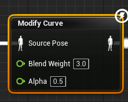
节点的细节面板。
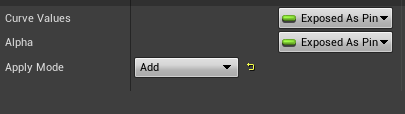
##### 曲线融合公式(以曲线 ```blendWeight```为例)
1. ```Apply Mode``` -> ```Add``` :不受```Alpha```值得影响，将输入引脚的```blendWeight（B）```的值和输入姿态中的```blendWeight (A)```直接进行相加：
   ```Out = A + B```
2. ```Apply Mode``` -> ```Scale``` : 不受```Alpha```值得影响：
   ```Out = A * B```
3. ```Apply Mode``` -> ```Blend``` :
   ```Out = A * (1 - Alpha) + B * Alpha```

### ALS 中 Base_Pose_N 曲线
#### 使用Base_Pose_N 曲线值 在BasePose中对 CLF和N（一帧的动画）基础姿态进行混合，用于后面能够一直匹配需要进行叠加的动画

```Base_Pose_N```曲线常驻值为 1 ， 当播放 ```ALS_CLF_to_N```和```ALS_N_to_CLF```时， 动画实例中的```Base_Pose_N```值 为 对应播放的动画中设置的```Base_Pose_N```值，在播放动画时，同时根据```Base_Pose_N```的值设置 BasePose的混合权重。

#### 获取两种基础姿势转换的叠加基础姿态 方法
1. 混合空间：使用两种 基础姿态的 一帧动画进行混合，通过变量 ```Pose_Transform_Curve```的值动态设置混合权重
2. 在两种基础姿势的过渡动画中 设置 ```Pose_Transform_Curve```曲线， 曲线值、过渡动画播放、混合节点权重进行统一对应。

### IK和IK骨骼
IK骨骼（创建的普通骨骼）是独立于原骨架的子骨骼树，即创建出的以root骨骼为父骨骼的子骨骼树。
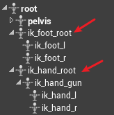
以手持枪为例，当骨骼重定向之后，由于枪的模型大小没有变，但是重定向的骨骼持枪动作时的双手间距发生变化，导致无法正确控制持枪位置。所以创建出IK骨骼不随```pelvis```骨骼树的变化而产生相对变化，这样直接 固定 IK骨骼树中的 IK_hands 间的相对位置，并且在动画制作中也保持 IK 骨骼树的 IK_hands 双手动画相对位置固定，并且将 ```平移重定向```设置为 ```动画驱动```。

##### IK(Inverse Kinematics) 逆向运动学
相对于正向运动学的按骨骼树的顺序计算transform，IK则是首先确定骨骼的位置(一般为末端的骨骼)，将骨骼移动到指定位置时，同时自动计算骨骼需要移动的transform。
##### Two Bone IK 蓝图节点以及细节面板
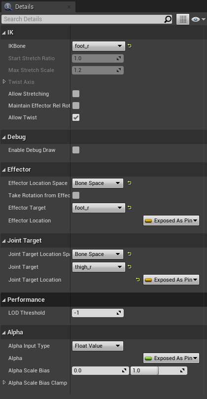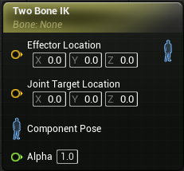

###### IK细节面板描述(以足部IK为例)
```IKBone```：需要移动位置的骨骼```foot_r```，一般为末端的骨骼。

###### Effector 
执行器，用于实时移动```IKBone```，移动方式设置为```Effector Location Space```相对空间坐标原点，```Effector Target```相对空间目标（以该目标的坐标为相对空间坐标原点）。

```Effector Location Space```：执行器的空间坐标系设置，分为```World Space```、```Component Space```、```Bone Space```、```Parent Bone Space```，其中```World Space```和```Component Space```是直接获取的，```Bone Space```和```Parent Bone Space```需要再设置```Effector Target```。

###### Joint Target
目标关节，为固定值，设置的目标关节朝向

###### IK 实现原理
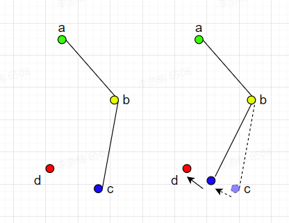
c为```IKBone```，即需要实时移动的末端骨骼，d为```Effector Location```，执行器在```Effector Target```的相对坐标原点的移动位置。目的是将c移动到指定的位置d，移动过程可以在每个动画帧实时更新。

#### 实现脚部IK的方法
角色在台阶上时，脚部会出现浮空的现象。脚部IK是实现脚部在台阶或者斜面正确站立的方法。
###### 射线检测
射线检测可以从指定的起点发射一条任意形状的射线到终点，射线在整个过程中会检测并返回到与之发生的碰撞对象的信息。

射线检测节点信息，其中输出节点```Out Hit```结构体可以拆分
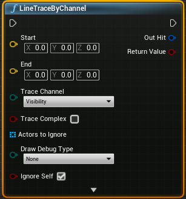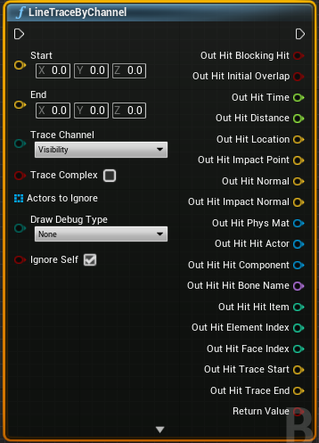

蓝图节点的射线函数类型命名形式：
(前缀：Multi) + 射线形状 + [后缀：ForObjects|ByChannel|ByProfile]
参考：https://zhuanlan.zhihu.com/p/369560738

###### 脚部IK
参考：https://zhuanlan.zhihu.com/p/84399021
##### 通过 IK骨骼 以及 IK将原骨骼与枪支位置绑定

...
### 延迟按键记录方法
当按键双击或者多击时，能够响应和单击不同的事件。


### C++中初始化\设置动画蓝图实例
```c++```中在```Character```类中获取动画蓝图实例需要先获取对应角色的骨骼网格组件，再通过骨骼网格组件获取动画蓝图实例
```C++
if (GetMesh())
	{
		MainAnimInstance = Cast<UALSCharacterAnimInstanceForDE>(GetMesh()->GetAnimInstance());
	}

```
即动画蓝图实例是通过骨骼网格组件获取的，同样，动画蓝图实例也可以获取拥有它的```Character```以及骨骼网格组件


### 自动化曲线绘制脚本
1. 创建```AnimationModifier```动画修改器蓝图类
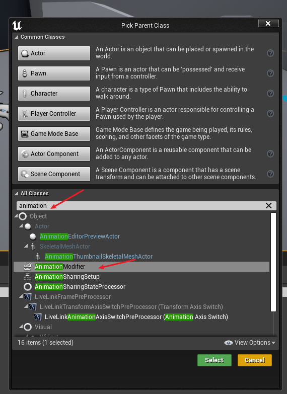
2. 在```AnimationModifier```蓝图类的```Event On Apply```事件中实现曲线绘制
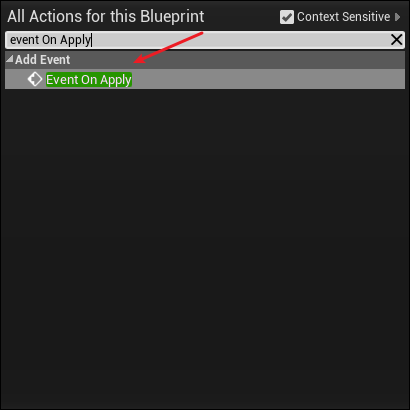
3. ```Add Float Curve Key```动画序列添加浮点关键帧节点
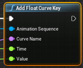
4. 在动画窗口中，```Window```列表中，打开```Animation Data Modifier```窗口
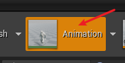
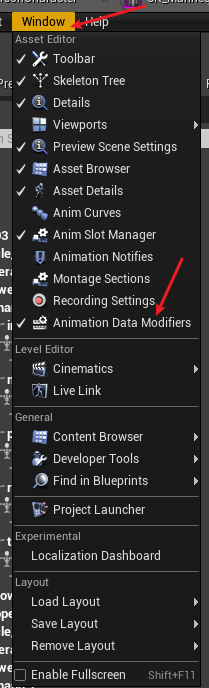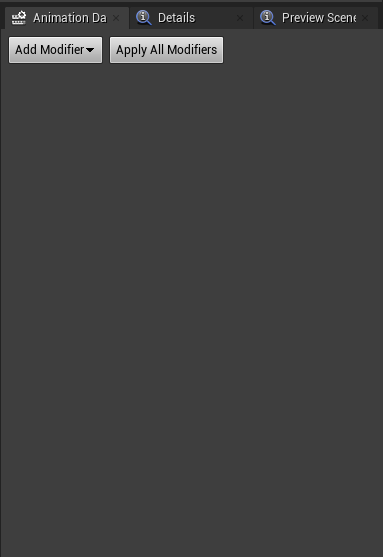
5. 在```Add Modifier```中选择多种不同的修改器，从而可以同时添加多个曲线，```Apply All Modifiers```应用选择的多个修改器生效。也可单独指定一个修改器创建曲线。
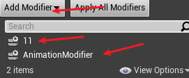

### 自动化外部曲线编辑脚本
在```Animation Modifier```中只能编辑动画中的曲线，而在编辑器中创建的曲线资产只能手动添加关键帧

#### 为外部曲线绘制动画序列的骨骼位置曲线 CurveModifier
动画序列中只能添加```Float```类型的曲线，无法添加```Vector```类型的曲线
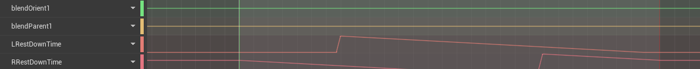
但是```Animation Modifier```拥有绘制各种类型曲线的功能，因此绘制```Vector```类型曲线动画序列不适用。

#### C++实现修改 外部曲线资源
蓝图中没有修改外部曲线的方法（目前未找到），C++中有对应的方法即：
```C++
//UCurveFloat* Curve
Curve->FloatCurve.AddKey(time, value);

//UCurveVector* Curve
Curve->FloatCurves[0].AddKey(time, value.X);
Curve->FloatCurves[1].AddKey(time, value.Y);
Curve->FloatCurves[2].AddKey(time, value.Z);
```
因此，使用```Animation Modifier```的获取动画序列任意帧、任意时间、任意骨骼位置的功能和C++可以修改外部曲线的功能，实现使用```Animation Modifier```修改外部曲线。

##### 实现步骤：
1. 在```Animation Modifier```直接添加实现修改曲线功能的方法：
```C++
// .h
UFUNCTION(BlueprintCallable, Category = "Curve Edit")
    void AddKeyFrameForCurveFloat(UCurveFloat* Curve, float time, float value);

UFUNCTION(BlueprintCallable, Category = "Curve Edit")
    void AddKeyFrameForCurveVector(UCurveVector* Curve, float time, FVector value);

//.cpp
void UAnimationModifier::AddKeyFrameForCurveFloat(UCurveFloat* Curve, float time, float value)
{
    if (Curve)
    {
        Curve->FloatCurve.AddKey(time, value);
    }
}

void UAnimationModifier::AddKeyFrameForCurveVector(UCurveVector* Curve, float time, FVector value)
{
    if (Curve)
    {
        Curve->FloatCurves[0].AddKey(time, value.X);
        Curve->FloatCurves[1].AddKey(time, value.Y);
        Curve->FloatCurves[2].AddKey(time, value.Z);
    }
}
```

### C++中 获取动画状态机的 MachineIndex 和 状态节点的 StateIndex ，以及获取对应节点的激活权重占比
```UAnimInstance```中 通过方法``` GetInstanceStateWeight()``` 获得
在源码```CachedAnimData```中有很好的应用实例


### 动画曲线混合的 总结

1. 混合空间的 playRate 会变换混合空间的动画播放，但是只是视觉效果，并不会影响 当前混合后的动画的 时长、曲线值（如 原 混合空间 的循环 时长为 2s， playrate 为2.0， 感官上，混合空间会 1s 循环一次动画， 但是 实际播放的进度条是 0s ~ 2s），只是为了匹配相应的 速度做出的调整。

2. 当两个动画（Anim_A 和 Anim_B）进行混合后（使用blend 或者 blend multi蓝图节点），当 Anim_B 的混合权重 Rate 从 0 变为 > 0 时，Anim_B 将从头开始播放， 此时 Anim_B 的动画曲线也是跟着 Anim_B 的动画时长，即从头开始的， 而 Anim_A 则是一直处在播放循环中。当某一时刻如 0.33s 时，Rate 从 0 变为 0.4，此时 Anim_A 在 0.33s ，Anim_B 在 0s ，此时的动画在Pose 混合 和 曲线混合都 不会达到理想的结果。
   同步组： 同步组解决了动画 激活时 的播放不同步问题 ， 当 Anim_A 和 Anim_B 设置为同一个同步组时， 当某一时刻如 0.33s 时，Rate 从 0 变为 0.4，此时 Anim_A 在 0.33s ，Anim_B 将跟随 领导者 Anim_A（设置领导者的获得方式，一般为混合权重高的获得）的动画 进度 ，即 立即播放到 0.33s。 曲线的混合也会完美匹配。（以上的动画序列  Anim_A 和 Anim_B 的动画时长完全一样， 当动画时长不一致时另需研究）

3. 不等长动画的 曲线混合同步
   对于相同名称的曲线，在不同的动画序列中的线性变化不同，动画将按照 播放的 百分比进行同步， 如领导者 播放到自己的 20%， 跟随者进行混合时，也会播放到 跟随者自己的 20%，使 跟随者 和 领导者 播放相同百分比的方法就是 改变 跟随者的播放速率，这个改变时引擎在后台改的。 

4. 同步组混合的 领导者 切换，领导者会根据 最高的混合度进行切换。切换后， 领导者 的播放速率还原， 原 领导者现在变为跟随者 的播放速率进行改变。

5. 混合空间中 的动画同步。
   


### 关于一套动画序列的资源需求总结，以ALS 的动画资源为例
一套动画序列： 如Run、Walk、Crouch三种姿态，每种姿态都要有固定的动画制作标准
不同姿态间的标准：
1. 方向一致：同时抬起 左脚或者右脚，且同一方向的动画 的移动方向要一致，动画序列自身要能够完美循环
2. 虽然动画时长可能不同，但是落脚，抬脚的步态，身体上升下降的姿态要按 比例对应
相同姿态下的标准（六个动画的相同标准）：
1. 脚部的相对世界空间的 Z轴的坐标曲线 变化要完全一致


### ALS中 Run和Walk的步态在混合空间中是瞬间切换的


### 无法解析的外部命令
方法有声明没定义

### 无法找到文件
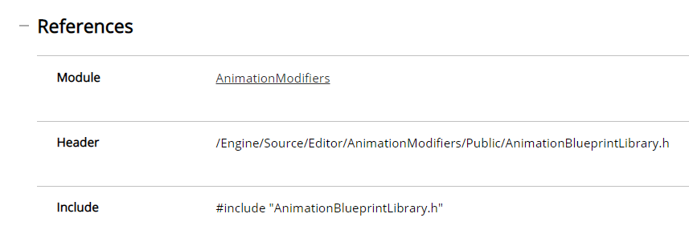
一般为头文件引用顺序问题
无法找到引擎的 文件，根据对应的类名，查找官网文档的类说明，查看Reference中的Module，并在build.cs中添加对应的Modu

##### 根据预测路径每段的直线长度的实际占比重新调整 时间
