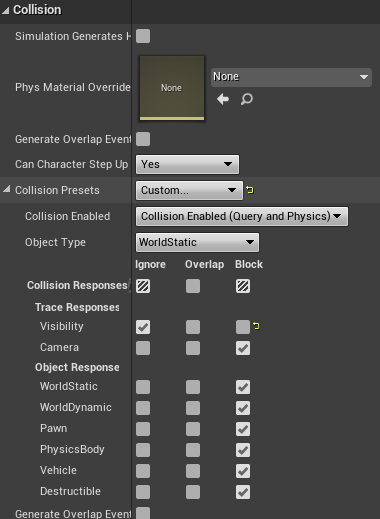
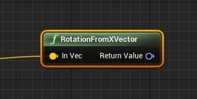
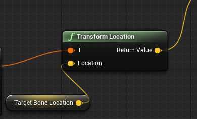
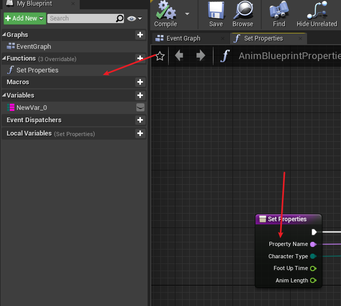
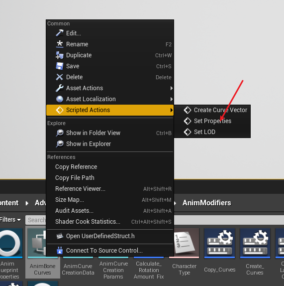
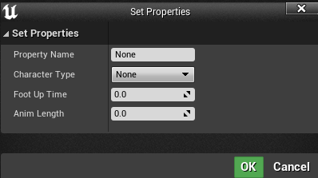
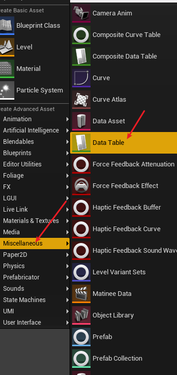
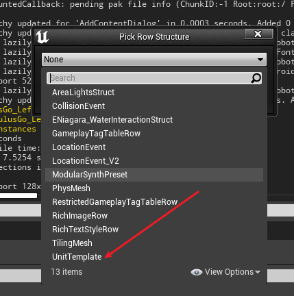

### 如何创建GameMode

### 在c++中的中文字符串 UE编辑器中显示乱码
```
使用TEXT()宏创建字符串
```
#

### (```C++```)在自定义```GameMode```:```UMGPracticeGameMode```中将UI控件输出到视口(```viewport```)
将```World```的默认```GameMode```设置为```UMGPracticeGameMode```


分别在```UMGPracticeGameMode```的```.h```和```.cpp```文件中添加以下代码：
```C++
// .h
public:
    /** 移除当前菜单控件，并在指定类（如有）中新建控件。*/
    UFUNCTION(BlueprintCallable, Category = "UMG Game")
    void ChangeMenuWidget(TSubclassOf<UUserWidget> NewWidgetClass);

protected:
    /** 游戏开始时调用。*/
    virtual void BeginPlay() override;

    /** 游戏开始时，用作菜单的控件类。*/
    UPROPERTY(EditAnywhere, BlueprintReadOnly, Category = "UMG Game")
    TSubclassOf<UUserWidget> StartingWidgetClass;

    /** 用作菜单的控件实例。*/
    UPROPERTY()
    UUserWidget* CurrentWidget;
```

```C++
// .cpp

#include "HowTo_UMG.h"
#include "HowTo_UMGGameMode.h"

void AHowTo_UMGGameMode::BeginPlay()
{
    Super::BeginPlay();
    ChangeMenuWidget(StartingWidgetClass);
}

void AHowTo_UMGGameMode::ChangeMenuWidget(TSubclassOf<UUserWidget> NewWidgetClass)
{
    if (CurrentWidget != nullptr)
    {
        CurrentWidget->RemoveFromViewport();
        CurrentWidget = nullptr;
    }
    if (NewWidgetClass != nullptr)
    {
        CurrentWidget = CreateWidget<UUserWidget>(GetWorld(), NewWidgetClass);
        if (CurrentWidget != nullptr)
        {
            CurrentWidget->AddToViewport();
        }
    }
}
```

### 绑定输入按键
#### 注：同一场景的AActor可以设置同一个Controller，多个AActor可以同时响应同一个按键（在BindAction().bConsumeInput=false将输入消耗设为否）
1. 通过蓝图直接创建对应的事件处理节点
   在项目设置->输入 中创建操作映射或者轴映射，

    在可以处理输入的蓝图中获取对应名称的蓝图事件节点

1. 通过```APawn```类或其子类，在 ```SetupPlayerInputComonent()```中，将对应的按键与按键触发的自定义处理函数绑定(绑定的系统按键可以在项目设置的input中设置)。
   ```C++
   void AKeyBoardCharacter::SetupPlayerInputComponent(UInputComponent* PlayerInputComponent)
    {
        Super::SetupPlayerInputComponent(PlayerInputComponent);
        PlayerInputComponent->BindAction("KeyUp", IE_Pressed, this, &AKeyBoardCharacter::KeyUp);
        PlayerInputComponent->BindAction("KeyDown", IE_Pressed,this, &AKeyBoardCharacter::KeyDown); 
    }

    void AKeyBoardCharacter::KeyDown()
    {
        number = number > 0 ? (number - 1) : number;
        UE_LOG(LogTemp, Warning, TEXT("Down"));
    }

    void AKeyBoardCharacter::KeyUp()
    {
        number = number < 9 ? (number + 1) : number;
    }
    ```
2. 对于一般的AActor类，也实现了对输入的响应，在AActor的类中设置```InputComponent()```绑定按键与要触发的自定义函数（一般的AActor并不是默认响应输入的，需要绑定当前的Controller）（同样需要在项目设置中的input中添加操作映射）
    ```C++
    void AClickTestActor::BeginPlay()
    {
        Super::BeginPlay();
        //获取PlayerController
        APlayerController* PlayerController = UGameplayStatics::GetPlayerController(GWorld, 0);
        if (PlayerController!=nullptr)
        {
            //传入Playercontroller开启Input
            EnableInput(PlayerController);
            //绑定按键方法
            InputComponent->BindAction("W", IE_Pressed, this, &AClickTestActor::ClickFunc);
        }
    }

    void AClickTestActor::ClickFunc()
    {
        UE_LOG(LogTemp, Warning, TEXT("Click W"));
    }

    ```

### 什么是UMG。
虚幻示意图形界面设计器（Unreal Motion Graphics UI Designer）(UMG) 是一个可视化的UI创作工具，可以用来创建UI元素，如游戏中的HUD、菜单或您希望呈现给用户的其他界面相关图形。UMG的核心是控件，这些控件是一系列预先制作的函数，可用于构建界面（如按钮、复选框、滑块、进度条等）。这些控件在专门的控件蓝图中编辑，该蓝图使用两个选项卡进行构造：设计器（Designer）选项卡允许界面和基本函数的可视化布局，而图表（Graph）选项卡提供所使用控件背后的功能。


### 关于更换Visual studio版本问题
更换```Visual studio```版本后，直接使用ue或项目部文件启动会出现不兼容的情况，需要在UE编辑器中的编辑栏->编辑器偏好设置->通用->源代码 中将启动项改为对应版本

### 插件加载
在新建项目中，启动编辑器，并在插件窗口中创建空的插件，此时项目文件夹将会产生```Plugins```文件夹，将对应插件文件夹复制到```Plugins```中，打开UE，在文件->刷新VS项目后，打开VS项目，关闭UE，VS中重新编译项目后，执行不调试。

### 插件添加子模块
在[ProjectName]->Plugins->[PluginName]->Source中

创建```MyPluginSub```新模块对应的文件夹，并初始化内容

初始化内容```MyPluginSub.Build.cs```文件、```Private```中的```MyPluginSub.cpp```和```Public```中的```MyPluginSub.h```文件。
（可以复制MyPlugin模块的对应文件，并替换内容实现初始化。或者新建项目中创建一个插件，复制对应的文件即可）
初始化结束后，重新生成项目

引擎版本在首次生成时使用，删除对应的```Intermediate```文件夹和.sln文件，再生成VS项目文件。


### 设置容器的可视性(按钮控制下拉列表是否可见)


控制对应的容器面板```MaterialList```的隐藏与显示
```C++
void UAttributesui::ShowMaterialPanel()
{
	
	if (MaterialList)
	{
		if (MaterialList->GetVisibility() == ESlateVisibility::Hidden)
		{
			ShowTriangleBtn(EParameListTye::E_MATERIAL, EParameListState::E_SHOW);
			MaterialList->SetVisibility(ESlateVisibility::SelfHitTestInvisible);
		}
		else
		{
			ShowTriangleBtn(EParameListTye::E_MATERIAL, EParameListState::E_HIDE);
			MaterialList->SetVisibility(ESlateVisibility::Hidden);
		}
	}
}
```

### ```C++```中创建控件蓝图实例和获取控件蓝图中的现有控件
#### 创建控件蓝图，编辑器中获取蓝图的引用

```C++
uiPath = TEXT("Blueprint \'/DelysiumWeaponEditor/Editor_UI/Blueprints/UI_Material_panel.UI_Material_panel_C\'");
MaterialTextureUiClass = LoadClass<UUserWidget>(nullptr, *uiPath);
NewWidget = CreateWidget<UUserWidget>(GetWorld(), MaterialTextureUiClass);
```
#### 获取蓝图实例中的控件
```C++
// "Attributes"为在蓝图控件中对应的控件变量名
UCanvasPanel* canvasPanel = dynamic_cast<UCanvasPanel*>(AttrbutesWidget->GetWidgetFromName(TEXT("Attributes")));
```

### ```C++```中为按钮控件动态绑定事
```C++
//获取按钮控件
DecalEditBtn = dynamic_cast<UButton*>(AttrbutesWidget->GetWidgetFromName(TEXT("IsEditBtn")));

if (DecalEditBtn)
{
    DecalEditBtn->OnPressed.AddDynamic(this, &UAttributesui::DwonDecalEdit);
}
```

### C++中将子控件添加到父控件上（一般父控件是一个容器）
对于不同类型的父容器控件，对应不同的方法
```C++
// 如画布作为父容器控件
panel->AddChildToCanvas(childWidget);
// 如垂直框作为父容器控件
verticalBox->AddChildToVerticalBox(childWidget);
```

### 动画姿势资产(Animation Pose Assert)
可以通过动画序列创建 动画姿势资产。动画姿势资产中，可以使用每一帧的动画，通过曲线驱动的方式创建出新的动画序列。

创建的动画序列需要设置预览姿势资产

通过对应的序号创建曲线


### 叠加动画(Additive Animation)
将要叠加的动画(PoseA)需要设置 叠加的基础姿势(BasePose)，在动画蓝图中与另一个动画叠加(PoseB)
```
D(a) = PoseA - PoseBase
PoseC = PoseB + D(a)
```
##### 叠加动画的动画蓝图节点
叠加动画使用：一般，2段不同的动画分别控制了不同的骨骼时，使用叠加，如2段动画，除了眨眼和张嘴存在差异，其余的骨骼都大致相同时，想要将眨眼和张嘴同时全部获取叠加在一起。
```应用Additive动画```节点对应 ```PoseC = PoseB + D(a)```↓

蓝图节点细节面板↓

设置```Alpha```节点控制 相当于叠加度，可以通过 设置```透明度输入类型```为```布尔值```或```动画曲线值```设置动画过渡↓

```混入时间``` 表示 ```应用Additive动画```节点中的 输入```Base```过渡到叠加后的节点的过度时间； ```混出时间``` 表示 从叠加后的状态到 ```应用Additive动画```节点中 输入

```Base```的过度时间。↑
#
```创建动态Additive```节点对应 ```D(a) = PoseA - PoseBase```


##### 创建动画序列的Additive
在动画序列的资产面板中设置 ```附加设置```

设置为以下形式，此时，该动画在动画蓝图中可作为Additive的输入。


局部空间(Local Space)的含义: 关节的本地空间，如```hand_l```的关节的局部空间为以其父关节为原点的空间。


### 骨架（Skeleton）
骨架由骨骼（关节）组成
```C++
//// 骨架和骨骼的结构体源码部分信息
```C++
struct FReferenceSkeleton
{
	FReferenceSkeleton(bool bInOnlyOneRootAllowed = true)
		:bOnlyOneRootAllowed(bInOnlyOneRootAllowed)
	{}

private:
	//RAW BONES: Bones that exist in the original asset
	/** Reference bone related info to be serialized **/
    ///  资产中骨架的骨骼信息
    // 骨架中 骨骼节点列表成员
	TArray<FMeshBoneInfo>	RawRefBoneInfo;
	/** Reference bone transform **/
    // 骨架中 对应索引的骨骼 Transform信息
	TArray<FTransform>		RawRefBonePose;


    /// 包含用户添加的虚拟骨骼的全部骨骼信息
	//FINAL BONES: Bones for this skeleton including user added virtual bones
	/** Reference bone related info to be serialized **/
	TArray<FMeshBoneInfo>	FinalRefBoneInfo;
	/** Reference bone transform **/
	TArray<FTransform>		FinalRefBonePose;

	/** TMap to look up bone index from bone name. */
	TMap<FName, int32>		RawNameToIndexMap;
	TMap<FName, int32>		FinalNameToIndexMap;

	// cached data to allow virtual bones to be built into poses
	TArray<FBoneIndexType>  RequiredVirtualBones;
	TArray<FVirtualBoneRefData> UsedVirtualBoneData;

	/** Whether this skeleton is limited to one root or not 
	 *	Multi root is not supported in general Skeleton/SkeletalMesh
	 *	But there are other components that can use this and support multi root - i.e. ControlRig
	 *	This sturct is used in draw code, the long term plan may be detach this from draw code
	 *	and use interface struct
	 */
	bool bOnlyOneRootAllowed;

    //....
}


struct FMeshBoneInfo
{
	// Bone's name.
	FName Name;

	// 0/NULL if this is the root bone. 
	int32 ParentIndex;
    // ....
};

```

骨架类源码(USkeleton)
```C++
/// 骨架类源码
```

通过骨架中的骨骼和transform信息可以看出骨架主要聚焦于动画的功能。
骨架资源可以共享给不同的骨架网格体，使得骨架网格体可以共享动画和动画蓝图

骨架其他功能：
1. 动画重定位
2. 创建和保存插槽
3. 保存动画通知
4. 保存动画曲线和保存槽名称

### 类Class 骨骼（骨架）（USkeleton）、骨骼网格(USkeletalMesh)、骨骼网格体组件(USkeletalMeshComponent)
```Skeleton```中存储的是```Bones```的信息，```Skeleton```是连接动画和骨骼网格的桥梁，动画的关键帧控制骨骼变换，骨骼通过顶点混合控制网格顶点的位置。

#
### 角色的移动是基于胶囊体实现的，因此对于没有胶囊体组件的Actor是无法正常使用UCharacterMovementComponent的。


### 角色（Pawn）和角色控制器(Controller)Transform

### 曲线

### 虚拟骨骼

### 直接使用的过渡方法
通过获取每一帧的时间间隔(delta， 事件Tick的 DeltaTime输出)，每次tick时进行delta的累加，把累加值作为blends的权重，实现过渡。

1. 创建函数```Update_Hand_With_Time```条件满足时，对变量```Up_Hand_Time```进行累加，不满足条件时，```Up_Hand_Time```递减，并限制```Up_Hand_Time```的范围```0~1```以满足混合权重的取值范围。


2. 在事件图表中调用函数```Update_Hand_With_Time```，实现tick时更新```Up_Hand_Time```d的值


3. 将变量```Up_Hand_Time```设置为混合节点的权重输入


### 蓝图接口
功能： 蓝图接口

### 节点转换

### 动画实例的曲线(AICurve)
每个```Tick```， ```AICurve```对应的值为 当前动画实例中的动画的值(可能是很复杂的混合动画，使得混合后的动画曲线也是各种 曲线自己(只有相同名称的曲线可以进行值运算) 混合后的值)。
动画实例的曲线默认值：

### Modify Curve 节点使用
```Modify Curve```将输入姿态的对应曲线和指定输入引脚的曲线进行融合，融合方式受```Apply Mode```和```Aplha```影响。

节点的细节面板。

##### 曲线融合公式(以曲线 ```blendWeight```为例)
1. ```Apply Mode``` -> ```Add``` :不受```Alpha```值得影响，将输入引脚的```blendWeight（B）```的值和输入姿态中的```blendWeight (A)```直接进行相加：
   ```Out = A + B```
2. ```Apply Mode``` -> ```Scale``` : 不受```Alpha```值得影响：
   ```Out = A * B```
3. ```Apply Mode``` -> ```Blend``` :
   ```Out = A * (1 - Alpha) + B * Alpha```

### ALS 中 Base_Pose_N 曲线
#### 使用Base_Pose_N 曲线值 在BasePose中对 CLF和N（一帧的动画）基础姿态进行混合，用于后面能够一直匹配需要进行叠加的动画

```Base_Pose_N```曲线常驻值为 1 ， 当播放 ```ALS_CLF_to_N```和```ALS_N_to_CLF```时， 动画实例中的```Base_Pose_N```值 为 对应播放的动画中设置的```Base_Pose_N```值，在播放动画时，同时根据```Base_Pose_N```的值设置 BasePose的混合权重。

#### 获取两种基础姿势转换的叠加基础姿态 方法
1. 混合空间：使用两种 基础姿态的 一帧动画进行混合，通过变量 ```Pose_Transform_Curve```的值动态设置混合权重
2. 在两种基础姿势的过渡动画中 设置 ```Pose_Transform_Curve```曲线， 曲线值、过渡动画播放、混合节点权重进行统一对应。

### IK和IK骨骼
IK骨骼（创建的普通骨骼）是独立于原骨架的子骨骼树，即创建出的以root骨骼为父骨骼的子骨骼树。

以手持枪为例，当骨骼重定向之后，由于枪的模型大小没有变，但是重定向的骨骼持枪动作时的双手间距发生变化，导致无法正确控制持枪位置。所以创建出IK骨骼不随```pelvis```骨骼树的变化而产生相对变化，这样直接 固定 IK骨骼树中的 IK_hands 间的相对位置，并且在动画制作中也保持 IK 骨骼树的 IK_hands 双手动画相对位置固定，并且将 ```平移重定向```设置为 ```动画驱动```。

##### IK(Inverse Kinematics) 逆向运动学
相对于正向运动学的按骨骼树的顺序计算transform，IK则是首先确定骨骼的位置(一般为末端的骨骼)，将骨骼移动到指定位置时，同时自动计算骨骼需要移动的transform。
##### Two Bone IK 蓝图节点以及细节面板


###### IK细节面板描述(以足部IK为例)
```IKBone```：需要移动位置的骨骼```foot_r```，一般为末端的骨骼。

###### Effector 
执行器，用于实时移动```IKBone```，移动方式设置为```Effector Location Space```相对空间坐标原点，```Effector Target```相对空间目标（以该目标的坐标为相对空间坐标原点）。

```Effector Location Space```：执行器的空间坐标系设置，分为```World Space```、```Component Space```、```Bone Space```、```Parent Bone Space```，其中```World Space```和```Component Space```是直接获取的，```Bone Space```和```Parent Bone Space```需要再设置```Effector Target```。

###### Joint Target
目标关节，为固定值，设置的目标关节朝向

###### IK 实现原理

c为```IKBone```，即需要实时移动的末端骨骼，d为```Effector Location```，执行器在```Effector Target```的相对坐标原点的移动位置。目的是将c移动到指定的位置d，移动过程可以在每个动画帧实时更新。

#### 实现脚部IK的方法
角色在台阶上时，脚部会出现浮空的现象。脚部IK是实现脚部在台阶或者斜面正确站立的方法。
###### 射线检测
射线检测可以从指定的起点发射一条任意形状的射线到终点，射线在整个过程中会检测并返回到与之发生的碰撞对象的信息。

射线检测节点信息，其中输出节点```Out Hit```结构体可以拆分


蓝图节点的射线函数类型命名形式：
(前缀：Multi) + 射线形状 + [后缀：ForObjects|ByChannel|ByProfile]
参考：https://zhuanlan.zhihu.com/p/369560738

###### 脚部IK
参考：https://zhuanlan.zhihu.com/p/84399021
##### 通过 IK骨骼 以及 IK将原骨骼与枪支位置绑定

...
### 延迟按键记录方法
当按键双击或者多击时，能够响应和单击不同的事件。


### C++中初始化\设置动画蓝图实例
```c++```中在```Character```类中获取动画蓝图实例需要先获取对应角色的骨骼网格组件，再通过骨骼网格组件获取动画蓝图实例
```C++
if (GetMesh())
	{
		MainAnimInstance = Cast<UALSCharacterAnimInstanceForDE>(GetMesh()->GetAnimInstance());
	}

```
即动画蓝图实例是通过骨骼网格组件获取的，同样，动画蓝图实例也可以获取拥有它的```Character```以及骨骼网格组件


### 自动化曲线绘制脚本
1. 创建```AnimationModifier```动画修改器蓝图类

2. 在```AnimationModifier```蓝图类的```Event On Apply```事件中实现曲线绘制

3. ```Add Float Curve Key```动画序列添加浮点关键帧节点

4. 在动画窗口中，```Window```列表中，打开```Animation Data Modifier```窗口


5. 在```Add Modifier```中选择多种不同的修改器，从而可以同时添加多个曲线，```Apply All Modifiers```应用选择的多个修改器生效。也可单独指定一个修改器创建曲线。


### 自动化外部曲线编辑脚本
在```Animation Modifier```中只能编辑动画中的曲线，而在编辑器中创建的曲线资产只能手动添加关键帧

#### 为外部曲线绘制动画序列的骨骼位置曲线 CurveModifier
动画序列中只能添加```Float```类型的曲线，无法添加```Vector```类型的曲线

但是```Animation Modifier```拥有绘制各种类型曲线的功能，因此绘制```Vector```类型曲线动画序列不适用。

#### C++实现修改 外部曲线资源
蓝图中没有修改外部曲线的方法（目前未找到），C++中有对应的方法即：
```C++
//UCurveFloat* Curve
Curve->FloatCurve.AddKey(time, value);

//UCurveVector* Curve
Curve->FloatCurves[0].AddKey(time, value.X);
Curve->FloatCurves[1].AddKey(time, value.Y);
Curve->FloatCurves[2].AddKey(time, value.Z);
```
因此，使用```Animation Modifier```的获取动画序列任意帧、任意时间、任意骨骼位置的功能和C++可以修改外部曲线的功能，实现使用```Animation Modifier```修改外部曲线。

##### 实现方法一：
1. 在```Animation Modifier```直接添加实现修改曲线功能的方法：
```C++
// .h
UFUNCTION(BlueprintCallable, Category = "Curve Edit")
    void AddKeyFrameForCurveFloat(UCurveFloat* Curve, float time, float value);

UFUNCTION(BlueprintCallable, Category = "Curve Edit")
    void AddKeyFrameForCurveVector(UCurveVector* Curve, float time, FVector value);

//.cpp
void UAnimationModifier::AddKeyFrameForCurveFloat(UCurveFloat* Curve, float time, float value)
{
    if (Curve)
    {
        Curve->FloatCurve.AddKey(time, value);
    }
}

void UAnimationModifier::AddKeyFrameForCurveVector(UCurveVector* Curve, float time, FVector value)
{
    if (Curve)
    {
        Curve->FloatCurves[0].AddKey(time, value.X);
        Curve->FloatCurves[1].AddKey(time, value.Y);
        Curve->FloatCurves[2].AddKey(time, value.Z);
    }
}
```

##### 实现方法二：
创建一个类声明定义上述的静态方法，便可直接在```Animation Modifier```中使用这些方法

### 动画曲线混合拆分与骨骼坐标混合：
脚部预测最终获取的混合曲线值CurrentAnimTime、L_UptoDown、R_UptoDown 是在 状态机 的Directional States 中融合后的值。脚部预测需要用到的骨骼坐标是从原始动画生成的骨骼坐标曲线获取的，因此需要根据当前的混合值 还原出每个参与混合的动画的实际 混合前的值，并根据混合前的值获取对应的骨骼坐标曲线Vector值，再将Vector值按照 各个动画的混合过程重新进行 Vector混合，最终得到混合后的 未来的落脚点的原始坐标。
#### 动画曲线混合拆分过程：


### 射线检测过滤通道
在物理上由碰撞效果，在射线检测上失效

```C++
	UWorld* World = GetWorld();
	check(World);
	TArray<AActor*> ActorsToIgnore;
	ActorsToIgnore.Add(Character);
	FHitResult HitResult;
	FCollisionShape BoxShape;
	BoxShape.SetBox(PredictConfig.Foot_Box_Trace_Half_Size);
	
	bool bHit = false;
	if (GetWorld())
	{
		bHit = GetWorld()->SweepSingleByChannel(HitResult, TraceStart, TraceEnd, FRotator(90, FootEndRotator.Rotator().Yaw, 90).Quaternion(), ECC_Visibility, BoxShape);
	}
```


### 创建曲线资源Asset的方法
```C++
    // 创建包
    FString packageName = StateDirectoryPath + "/" + StateCurveFileName;
    UPackage* package = CreatePackage(*packageName);
    package->FullyLoad();

    // 创建实例
    UCurveVector* myCreateObject = NewObject<UCurveVector>(package, *StateCurveFileName, RF_Public | RF_Standalone);

    // 保存Package
    FAssetRegistryModule::AssetCreated(myCreateObject);
    package->SetDirtyFlag(true);
```


### 获取向量在世界坐标空间的 方向。
将任意Vector 所指的方向 输出为 Rotator
```C++
    // 计算向量
	FVector BalltoFoot = PredictBallLocation - FootEndLocation;

    // 获取向量的 XY 分量的 Rotator
	FRotator TraceRotator = UKismetMathLibrary::Conv_VectorToRotator(FVector(BalltoFoot.X, BalltoFoot.Y, 0.0f));
```


【蓝图】：


### 【蓝图】将坐标转换为 相对于某个位置的坐标
以某个位置为原点转换坐标


### ```C++```动态创建资源方法：
1. 创建Actor及派生类对象 ```UWorld::SpawnActor()```
   ```C++
    UWorld* World = GetWorld();  
    FVector pos(150, 0, 20);  
    AMyActor* MyActor = World->SpawnActor<AMyActor>(pos, FRotator::ZeroRotator);    
   ```
2. 创建组件，为Actor创建组件 UObject::CreateDefaultSubobject()，只能在无参构造函数中使用
    ```C++
    MyComponent = CreateDefaultSubobject<UMyActorComponent>(TEXT("MyComponent")); 
    ```


### C++中为蓝图设置属性
获取蓝图的反射对象，通过反射对象获取到属性，再将属性转为对应数据类型的属性。
```C++
    UAnimBlueprintGeneratedClass* Obj = LoadObject<UAnimBlueprintGeneratedClass>(nullptr, TEXT("AnimBlueprint'/ALSV4_CPP/AdvancedLocomotionV4/CharacterAssets/MannequinSkeleton/ALS_AnimBP.ALS_AnimBP_C'"));

	if (!Obj)
	{
		return;
	}
	UClass* classPtr = Obj->GetOwnerClass();
	UObject* DefaultObject = Obj->GetDefaultObject();

    // 根据属性名查找FProperty
    FProperty* Pro = classPtr->FindPropertyByName("IKScale");
    
    // 将获取的FPropert转换为对应属性类型的值
    FFloatProperty* Property = CastField<FFloatProperty>(Pro);

    // 获取一般类型的属性 例如 FIntProperty* Property ， ArrayIndex默认0
    Property->GetPropertyValue_InContainer(Object, ArrayIndex);


    // 设置Struct属性，T 表示具体的结构体类型名称
    *StructProp->ContainerPtrToValuePtr<T>(Object) = Value;

    *StructPro->ContainerPtrToValuePtr<FBehaviorCurvesResource>(DefaultObject) = *BehaviorCurvesResource;

    // 获取结构体属性
    return *StructProp->ContainerPtrToValuePtr<T>(Object);
```

### EditorUtilityBlueprint 工具蓝图
在蓝图中创建函数

在资源管理器中列表中，右键资源执行函数
可以设置函数的输入，在执行函数时弹出输入窗口



### C++中定义一个UObject指针需要 加UPROPERTY()，这样对反射系统可见，用于垃圾回收

### C++中的三个宏： __FUNCTION__, __FILE__, __LINE__
1.  __FUNCTION__ ：

### UE 中的智能指针：UE中的通过相关宏标记的类型将会加入到垃圾回收系统中，不需要手动管理内存的释放，而一些自定义的不适用宏标记的类型则需要使用智能指针进行自动内存管理。如 F 类型文件

### UE UObject 动态类型转换：Cast<>()

### UE 创建 UObject 类型实例： NewObject<>()

### UE 创建 AActor类型实例： UWorld->SpawnActor<>()

### LOG
```UE_LOG(LogTemp, Log/Warning/Error, TEXT("Your message"));
```

### UE 数据表格
#### C++创建表格行类型结构体，需要继承 ```FTableRowBase``` ，继承```FTableRowBase```后的C++结构体，将会在UE编辑器中生成新的UDataTable表格类型（UDataTable为表格，FTableRowBase为该表格的行类型）
```C++
USTRUCT(BlueprintType)
struct FUnitTemplate : public FTableRowBase
{
    GENERATED_BODY()

    UPROPERTY(EditAnywhere, BlueprintReadWrite, Category = ItemTemplate)
    float value;
    UPROPERTY(EditAnywhere, BlueprintReadWrite, Category = ItemTemplate)
    FString Name;
}
```


#### 获取表格资源
```C++
	UDataTable* UnitDataTable = Cast<UDataTable>(StaticLoadObject
	(UDataTable::StaticClass(), NULL,
		*FString("DataTable'/Game/UnitTemplate.UnitTemplate'")));
```

#### 通过表格查找指定```id``` 的行
```C++
UDataTable* Table;
FUnitTemplate* TableRow = Table->FindRow<FUnitTemplate>(FName RowId); // nullptr 或 FTableRowBase
``` 


### 插件文件无法 include 项目文件

### 文件以及路径
#### 获取项目的根目录
```C++
FPaths::ProjectDir() 
//return  ../../../../UE5Projects/FileSystem/
                    //项目存储位置 // 项目文件
```

#### 获取Object 资源对象的文件路径
```C++
GetPathNameSafe(Anim)

//return    
```

#### 查找指定文件夹 的 指定类型的文件
```C++
IPlatformFile& FileManager = FPlatformFileManager::Get().GetPlatformFile();
TArray<FString> FileNames;
FileManager.FindFiles(FileNames, *FullDirPath, TEXT("json"));
// return Array :  ../../../../UE5Projects/FileSystem/Content/File/FileName.Json
```

#### 文件路径拆分 对一个完整的文件路径进行拆分为： 所在文件夹   文件名   文件后缀名
```C++
FString PathPart;
FString FilenamePart;
FString ExtensionPart;


FString fileName;  // value : ../../../../UE5Projects/FileSystem/Content/File/Anim.Animation
FPaths::Split(fileName, PathPart, FilenamePart, ExtensionPart);
// return PathPart: ../../../../UE5Projects/FileSystem/Content/File/
// return FilenamePart: Anim
// return ExtensionPart : Animation
```

#### Json文件的加载和反序列化
```C++
FString jsonStr;
FFileHelper::LoadFileToString(jsonStr, *fileName);  // fileName value: ../../../../UE5Projects/FileSystem/Content/File/FileName.Json
if (jsonStr.IsEmpty())
{
    continue;
}

TSharedRef< TJsonReader<> > Reader = TJsonReaderFactory<>::Create(jsonStr);

if (FJsonSerializer::Deserialize(Reader, TempJsonFile))
{
}

// return  TSharedPtr<FJsonObject> TempJsonFile 保存结果
```