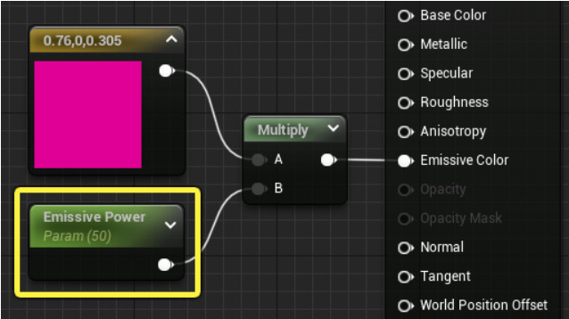
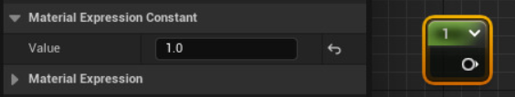
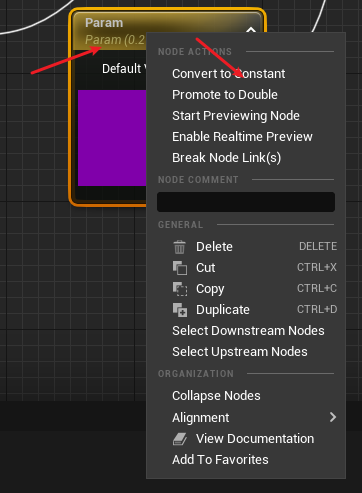

### 主材质节点 输入值 的类型
1. Base Color ： Float3 0~1
2. Metallic(金属感): Float 0~1
3. Specular(高光度): Float 0~1
4. Roughness(粗糙度): Float 0~1
5. Emissive Color(自发光颜色): Float3
   
6. World Position Offset(世界位置偏移): Float3 -> Constant3Vector
   定义材质在世界空间中的 额外偏移
7. Opacity(不透明度): Float

### 开放到外部的 变量 : 标量参数(Scalar Parameter)

### 常量参数(Constant Material Expression)

### 常量 <--> 变量 转换
鼠标右键点击 节点

> Float4的输出 连接到 Float3 的输入时将 丢弃alpha通道

### 材质表达式的 组合和分离 https://docs.unrealengine.com/5.0/zh-CN/material-data-manipulation-and-arithmetic-in-unreal-engine/

#### AppendVector

### 设置材质的 Blend Mode 为Translucent （半透明）并且 设置Disable Depth Test设置为ture：可以使物体透视，但是会产生物体的透视部分随镜头晃动的现象
