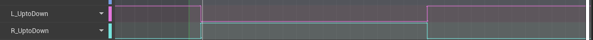

#### 1. 基于预测的IK 分为两大部分：脚部路径预测， 身体路径预测
##### 身体路径预测
直接计算臀部或者盆骨的位移，而不是移动root。

### 2. 使用曲线代替通知
动画对应的曲线值，L_UptoDown非0即1（这里是脚抬起到落地的固定时长0.56）

曲线值为0时，更新脚踝起始位置(StartLocation)，当大于0时，则停止更新StartLocation
为动画设置 时间曲线，以获取当前播放动画的时间点，同理，抬脚前更新时间，抬脚后固定时间作为起始时间点。
### 3. 射线检测方案优化

### 4. 过渡点数量优化

### 5. 实际路径计算优化

### 6. 多种Grounded状态： 跑，蹲，走，站立

### 7. 脚部落地点射线检测
以脚踝为中心创建BoxTraceByChannel, 以Out Hit Impact point 为脚底的落地点，以Out Hit Location 作为脚踝的目标点
### 8. 横向扫射障碍物，以脚踝起点和终点的位置作为横向射线的边缘
