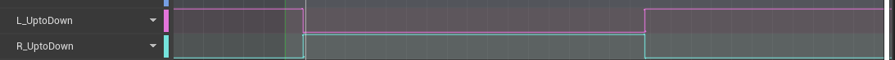

#### 1. 基于预测的IK 分为两大部分：脚部路径预测， 身体路径预测
##### 身体路径预测
直接计算臀部或者盆骨的位移，而不是移动root。

### 2. 使用曲线代替通知
动画对应的曲线值，L_UptoDown非0即1（这里是脚抬起到落地的固定时长0.56）

曲线值为0时，更新脚踝起始位置(StartLocation)，当大于0时，则停止更新StartLocation
为动画设置 时间曲线，以获取当前播放动画的时间点，同理，抬脚前更新时间，抬脚后固定时间作为起始时间点。
### 3. 射线检测方案优化

### 4. 过渡点数量优化

### 5. 实际路径计算优化

### 6. 多种Grounded状态： 跑，蹲，走，站立

### 7. 脚部落地点射线检测
以脚踝为中心创建BoxTraceByChannel, 以Out Hit Impact point 为脚底的落地点，以Out Hit Location 作为脚踝的目标点
### 8. 横向扫射障碍物，以脚踝起点和终点的位置作为横向射线的边缘

##### 落脚点是基于当前瞬时速度计算的...

### 过渡点选择
由于角色的路径预测是每次抬脚时进行的，因此预测的落地点和起始点的直线始终低于角色脚的运动轨迹，因此，过渡点一定是高于这条直线的点

### 脚部决定盆骨的上下位移
每一次AnimUpdate 更新前后脚信息，一只脚作为前脚，另一只作为后脚，判断前后脚的方法是 使用 CurveVector 曲线的 Y 值 比较。

只有后脚的上升路径（相对于另一只脚当前的位置）才会抬高盆骨，只有前脚的下降路径（相对于另一只脚当前的位置，）才会下降盆骨。

以上条件不满足时：则盆骨会根据预测的路径矫正实际路径

### 支撑脚始终保持固定位置不变，因此偏移实时计算

#### 脚部IK 
#### 脚部 IK 的 坐标转换
#### 过渡点 过滤算法优化

#### BlueprintEditor.cpp - > void FBlueprintEditor::Compile()

##### 视觉上 脚部落地时 为什么和 碰撞的盒子位置不吻合。
动画的落脚点选取时间靠前，当触发落脚时，实际上脚并未完全落地，而此时的脚和盒子是完全匹配的。

